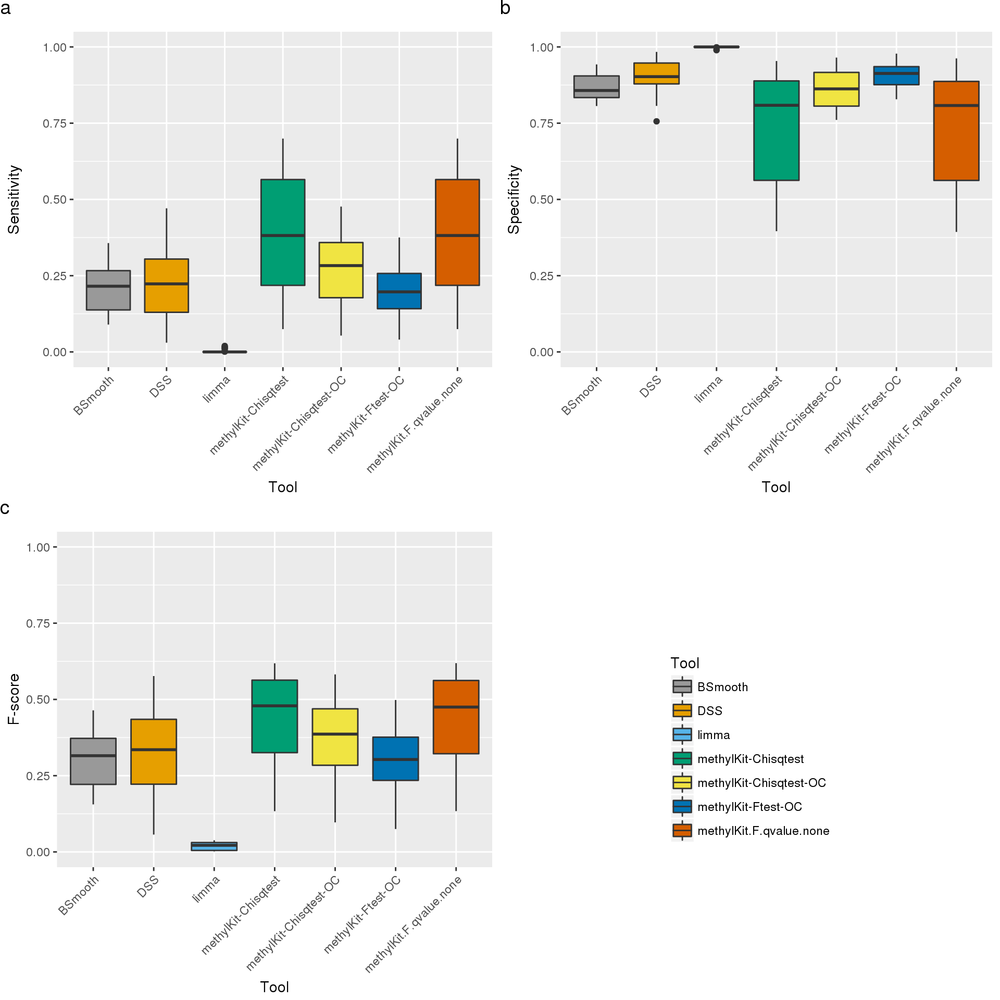
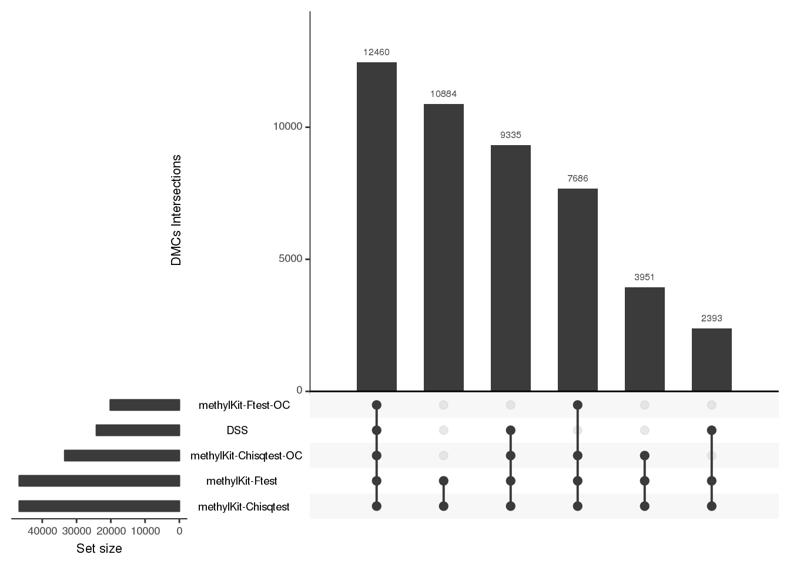

Strategies for analyzing bisulfite-seq data on CTCF data
================
Katarzyna Wreczycka
2017-07-31

Goal
====

We compared the performance of different methods for calling differentially methylated cytosines using real bisulfite sequencing experiments where we expect to see changes between samples on certain locations. Stadler and colleagues showed that DNA-binding factors can create low-methylated regions upon binding (Stadler et al., Nature 2011). They further show that the reduced methylation is a general feature of CTCF-occupied sites and if the site is unoccupied, the region on and around the site will have high methylation. This means that if the CTCF occupancy changes between two cell types, we expect to see a change in the methylation levels as well. Armed with this information, we looked for differentially methylated bases on regions that gained or lost CTCF binding between two cell types.

We used CTCF binding sites derived form the ENCODE database for selecting methylation sensitive regions. Since it has beed shown by Maurano et al. Cell Rep. 2015 that DNA methylation changes were only likely to occur with binding site dynamics where the binding site was supported by a CTCF motif, we filtered CTCF peaks tare supported by CTCF DNA motifs from the Factorbook motifs (wgEncodeRegTfbsClusteredV3 ENCODE Mar 2012 Freeze (last updated 2013-07-21)).

Functions
=========

Load libraries and functions.

``` r
library("methylKit")
library(tools)
library(readr)
library(genomation)
library(ggplot2)
library(grid)
library(gridExtra)

source("./functions/functions.R")
```

Set global variables for input and output files.

``` r

# the Supplem. Table 2 from the paper (Stadler et al., Nature 2011)
Table_S2.file = "/home/kwreczy/projects/Strategies_for_analyzing_bisulfite-seq_data/data/Table_S2_Location_of_ChIP-seq_binding_positions_in_19_cell_lines.txt"
# Output directory where the ENCODE RRBS CTCF bed files will be saved
RRBS_CTCF_DIR = "/data/akalin/Base/Encode/Rrbs/wgEncodeHaibMethylRrbs/"
# Output directory where the Factorbook motifs will be saved
Factorbook_DIR = "/data/akalin/kwreczy/projects/Strategies_for_analyzing_bisulfite-seq_data/"
Factorbook.motifs.path = paste0(Factorbook_DIR, "wgEncodeRegTfbsClusteredV3.bed.gz")
```

Download RRBS data for CTCF and CTCF DNA motifs.

``` r

#' # Download RRBS data for CTCF

download.RRBS.CTCF = function(output.dir, cores=10){
  
  url="http://hgdownload.cse.ucsc.edu/goldenPath/hg19/encodeDCC/wgEncodeHaibMethylRrbs/files.txt"
  download.file(url, 
              destfile=paste0(output.dir, "files.txt"),
              method="wget",
              quiet = FALSE, mode = "w",
              cacheOK = TRUE)

  tbl = read.table(paste0(output.dir, "files.txt"), sep="\t")
  file.names = tbl[,1]
  file.bed = as.character(file.names[which(file_ext(file_path_sans_ext(file.names)) ==  "bed")])
  links = paste0("http://hgdownload.cse.ucsc.edu/goldenPath/hg19/encodeDCC/wgEncodeHaibMethylRrbs/",
               file.bed)
  link2bedfiles = paste0(output.dir, "link2bedfiles.txt")
  write.table(links, file=link2bedfiles,
            quote = FALSE,  sep = "\n", row.names = FALSE, col.names = FALSE)

  command = paste0("cat ", link2bedfiles," | xargs -n 1 -P ", cores,"  curl -O -L")
  print(command)
  system(command)
  
}


# download.RRBS.CTCF(RRBS_CTCF_DIR)


#' # CTCF DNA motifs form the Factorbook database

download.Factorbook = function(output.dir){
  url="http://hgdownload.cse.ucsc.edu/goldenpath/hg19/encodeDCC/wgEncodeRegTfbsClustered/wgEncodeRegTfbsClusteredV3.bed.gz"
  download.file(url, 
              destfile=paste0(output.dir, "wgEncodeRegTfbsClusteredV3.bed.gz"),
              method="wget",
              quiet = FALSE, mode = "w",
              cacheOK = TRUE)
}

# download.Factorbook(Factorbook_DIR)
```

Load filenames of ENCODE RRBS bed files, extract cell lines names the filenames and create a data.frame out of it.

``` r
remove.nonalpha.upper = function(x){
  require(stringr)
  # Swap out all non-alphanumeric characters.
  x = str_replace_all(x, "[^[:alnum:]]", " ")
  # make all letters big
  upperx = toupper(x)
  # remove white spaces
  gsub(" ", "", upperx, fixed = TRUE)
}
#' Read locations of RRBS files for every cell line
rrbs = read.table("/data/akalin/Base/Encode/Rrbs/wgEncodeHaibMethylRrbs/files.txt", 
                  sep="\t",stringsAsFactors = FALSE, col.names=c("filename", "other"))
rrbs.bed = as.character(rrbs$filename[which(file_ext(file_path_sans_ext(rrbs$filename)) ==  "bed")])
rrbs.bed.uw = rrbs.bed[which(grepl("UwSites", rrbs.bed))]
my.list = strsplit(substring(rrbs.bed.uw, 23),split = "UwSites")
rrbs.cell.lines = unlist(lapply(my.list, function(x) x[[1]]))
rrbs.tbl =data.frame(# filenames
                     bed=rrbs.bed.uw, 
                     # names of cell lines wihout non-alphanumeric characters, white spaces, and capital letters 
                     celline = remove.nonalpha.upper(rrbs.cell.lines),
                     # original names of cell lines (form the files.txt file)
                     celline.o=rrbs.cell.lines,
                     stringsAsFactors = FALSE)

print(head(rrbs.tbl))
##                                               bed celline celline.o
## 1 wgEncodeHaibMethylRrbsAg04449UwSitesRep1.bed.gz AG04449   Ag04449
## 2 wgEncodeHaibMethylRrbsAg04449UwSitesRep2.bed.gz AG04449   Ag04449
## 3 wgEncodeHaibMethylRrbsAg04450UwSitesRep1.bed.gz AG04450   Ag04450
## 4 wgEncodeHaibMethylRrbsAg04450UwSitesRep2.bed.gz AG04450   Ag04450
## 5 wgEncodeHaibMethylRrbsAg09309UwSitesRep1.bed.gz AG09309   Ag09309
## 6 wgEncodeHaibMethylRrbsAg09309UwSitesRep2.bed.gz AG09309   Ag09309
```

Load CTCF peaks from the Supplem. Table 2 from the paper (Stadler et al., Nature 2011).

``` r
#' Read supplementary table from the paper
#' And match cell line names from the paper with cell line names from the rrbs bed files.
supp.tbl2.o = read_delim(Table_S2.file, delim="\t")
## Parsed with column specification:
## cols(
##   .default = col_integer(),
##   chrom = col_character(),
##   ID = col_character(),
##   strand = col_character(),
##   AG09309_density = col_double(),
##   AG09319_density = col_double(),
##   AG10803_density = col_double(),
##   AoAF_density = col_double(),
##   BJ_density = col_double(),
##   `Caco-2_density` = col_double(),
##   GM06990_density = col_double(),
##   HBMEC_density = col_double(),
##   HEEpiC_density = col_double(),
##   `Hela-S3_density` = col_double(),
##   HepG2_density = col_double(),
##   HMF_density = col_double(),
##   HPAF_density = col_double(),
##   HPF_density = col_double(),
##   HRE_density = col_double(),
##   K562_density = col_double(),
##   SAEC_density = col_double()
##   # ... with 2 more columns
## )
## See spec(...) for full column specifications.
# Unify names of cell lines
print(colnames(supp.tbl2.o))
##  [1] "chrom"              "chromStart"         "chromEnd"          
##  [4] "ID"                 "strand"             "MCV#"              
##  [7] "AG09309_pk"         "AG09319_pk"         "AG10803_pk"        
## [10] "AoAF_pk"            "BJ_pk"              "Caco-2_pk"         
## [13] "GM06990_pk"         "HBMEC_pk"           "HEEpiC_pk"         
## [16] "Hela-S3_pk"         "HepG2_pk"           "HMF_pk"            
## [19] "HPAF_pk"            "HPF_pk"             "HRE_pk"            
## [22] "K562_pk"            "SAEC_pk"            "SK-N-SH_RA_pk"     
## [25] "WERI-Rb-1_pk"       "AG09309_density"    "AG09319_density"   
## [28] "AG10803_density"    "AoAF_density"       "BJ_density"        
## [31] "Caco-2_density"     "GM06990_density"    "HBMEC_density"     
## [34] "HEEpiC_density"     "Hela-S3_density"    "HepG2_density"     
## [37] "HMF_density"        "HPAF_density"       "HPF_density"       
## [40] "HRE_density"        "K562_density"       "SAEC_density"      
## [43] "SK-N-SH_RA_density" "WERI-Rb-1_density"
supp.tbl2 = supp.tbl2.o[ , c(1:6, grep('pk', colnames(supp.tbl2.o))) ]

supp.cellines = colnames(supp.tbl2)[7:ncol(supp.tbl2)]
supp.cellines = sapply(strsplit(supp.cellines, "_"), function(x){
            if(length(x)==3){
              paste0(x[1],"_", x[2])
            }else{
              x[1]
            }
  })
supp.cellines = data.frame(cell.line.o=supp.cellines, # original cell line names
                           cell.lines=remove.nonalpha.upper(supp.cellines),
                           stringsAsFactors = FALSE)
print(head(supp.cellines))
##   cell.line.o cell.lines
## 1     AG09309    AG09309
## 2     AG09319    AG09319
## 3     AG10803    AG10803
## 4        AoAF       AOAF
## 5          BJ         BJ
## 6      Caco-2      CACO2
supp.tbl2.1 = supp.tbl2
colnames(supp.tbl2.1) = c( colnames(supp.tbl2)[1:6],  supp.cellines$cell.lines)
print(colnames(supp.tbl2.1))
##  [1] "chrom"      "chromStart" "chromEnd"   "ID"         "strand"    
##  [6] "MCV#"       "AG09309"    "AG09319"    "AG10803"    "AOAF"      
## [11] "BJ"         "CACO2"      "GM06990"    "HBMEC"      "HEEPIC"    
## [16] "HELAS3"     "HEPG2"      "HMF"        "HPAF"       "HPF"       
## [21] "HRE"        "K562"       "SAEC"       "SKNSHRA"    "WERIRB1"

#' Convert peaks form the supplementary table to A GRanges object
supp.tbl2.gr = makeGRangesFromDataFrame(supp.tbl2.1,
                                   keep.extra.columns=TRUE)

print(head(supp.tbl2.gr))
## GRanges object with 6 ranges and 21 metadata columns:
##       seqnames           ranges strand |          ID      MCV#   AG09309
##          <Rle>        <IRanges>  <Rle> | <character> <integer> <integer>
##   [1]     chr1 [237692, 237826]      + |        id-1        19         1
##   [2]     chr1 [521475, 521609]      + |        id-2        17         1
##   [3]     chr1 [714122, 714256]      - |        id-3        19         1
##   [4]     chr1 [785901, 786035]      + |        id-4        14         1
##   [5]     chr1 [793406, 793540]      + |        id-5        18         1
##   [6]     chr1 [805240, 805374]      + |        id-6        19         1
##         AG09319   AG10803      AOAF        BJ     CACO2   GM06990
##       <integer> <integer> <integer> <integer> <integer> <integer>
##   [1]         1         1         1         1         1         1
##   [2]         1         1         1         1         1         1
##   [3]         1         1         1         1         1         1
##   [4]         1         1         1         1         1         0
##   [5]         1         1         1         1         1         1
##   [6]         1         1         1         1         1         1
##           HBMEC    HEEPIC    HELAS3     HEPG2       HMF      HPAF
##       <integer> <integer> <integer> <integer> <integer> <integer>
##   [1]         1         1         1         1         1         1
##   [2]         0         1         1         1         1         1
##   [3]         1         1         1         1         1         1
##   [4]         1         0         0         1         1         1
##   [5]         1         1         1         1         1         1
##   [6]         1         1         1         1         1         1
##             HPF       HRE      K562      SAEC   SKNSHRA   WERIRB1
##       <integer> <integer> <integer> <integer> <integer> <integer>
##   [1]         1         1         1         1         1         1
##   [2]         0         1         1         1         1         1
##   [3]         1         1         1         1         1         1
##   [4]         1         1         1         0         0         1
##   [5]         1         0         1         1         1         1
##   [6]         1         1         1         1         1         1
##   -------
##   seqinfo: 22 sequences from an unspecified genome; no seqlengths
```

Filter CTCF peaks based on overlap with Factorbook CTCF DNA motifs.

``` r
Factorbook.motifs = readGeneric(file=Factorbook.motifs.path, 
                                chr = 1, start = 2, end = 3, strand = NULL,
                                sep = "\t", meta.cols = list(TFname=4))
motifs.CTCF = Factorbook.motifs[which(Factorbook.motifs$TFname == "CTCF")]
supp.tbl2.gr.CTCFmotif = subsetByOverlaps(supp.tbl2.gr, motifs.CTCF)

# Almost all CTCF peaks from the supplementary contain a CTCF motif
paste0("Percent of CTCF peaks from Stadler et al that overlap CTCF DNA motifs = ", round(length(supp.tbl2.gr.CTCFmotif) / length(supp.tbl2.gr), 4) * 100, "%")
## [1] "Percent of CTCF peaks from Stadler et al that overlap CTCF DNA motifs = 99.94%"
```

Match cell line names from the Supplem. Table 2 with cell line names from the ENCODE RRBS bed files.

``` r

# Filter cell lines that are in all sets: in suppl table and rrbs set
# INFO: I get only 9 cell lines
cl.in.all = supp.cellines$cell.lines[
  which(supp.cellines$cell.lines %in% unique(rrbs.tbl$celline))
  ]
print(cl.in.all)
## [1] "AG09309" "AG09319" "AG10803" "BJ"      "CACO2"   "GM06990" "HRE"    
## [8] "SAEC"    "SKNSHRA"

#' Create a data frame with all combinations of cell lines (non-symetric)
#' in rows. It has two columns of names of cell lines.
all.comb <- expand.grid(cellline1=cl.in.all, 
                   cellline2=cl.in.all,
                   stringsAsFactors=FALSE,
                   KEEP.OUT.ATTRS = FALSE)
# Deleting reversed duplicates
comb = all.comb[!duplicated(apply(all.comb,1,function(x) paste(sort(x),collapse=''))),]
# Remove rows where cell line are the same
wh.re = which(comb[,1]==comb[,2])

# Combination of cellline pairs
comb.of.cellline.pairs = comb[-wh.re,]

print("Combination of pairs of cell lines")
## [1] "Combination of pairs of cell lines"
print(comb.of.cellline.pairs)
##    cellline1 cellline2
## 2    AG09319   AG09309
## 3    AG10803   AG09309
## 4         BJ   AG09309
## 5      CACO2   AG09309
## 6    GM06990   AG09309
## 7        HRE   AG09309
## 8       SAEC   AG09309
## 9    SKNSHRA   AG09309
## 12   AG10803   AG09319
## 13        BJ   AG09319
## 14     CACO2   AG09319
## 15   GM06990   AG09319
## 16       HRE   AG09319
## 17      SAEC   AG09319
## 18   SKNSHRA   AG09319
## 22        BJ   AG10803
## 23     CACO2   AG10803
## 24   GM06990   AG10803
## 25       HRE   AG10803
## 26      SAEC   AG10803
## 27   SKNSHRA   AG10803
## 32     CACO2        BJ
## 33   GM06990        BJ
## 34       HRE        BJ
## 35      SAEC        BJ
## 36   SKNSHRA        BJ
## 42   GM06990     CACO2
## 43       HRE     CACO2
## 44      SAEC     CACO2
## 45   SKNSHRA     CACO2
## 52       HRE   GM06990
## 53      SAEC   GM06990
## 54   SKNSHRA   GM06990
## 62      SAEC       HRE
## 63   SKNSHRA       HRE
## 72   SKNSHRA      SAEC
```

Load ENCODE RRBS bed files and convert them into a methylBase objects that contain columns indicating coverage and number of methylated and unmetylated Cs for every replicate of every cell line.

``` r

#' Read RRBS bed files into a methylBase object
#'
#' Combine information from RRBS data sets for 2 cell lines (each cell line has 2 replicates)
#' into a methylBase object fom the methylKit library. Coverage and number of methylated
#' and unmetylated Cs from every replicate for each cell line is represented as a separate column.
#'
#' @c1, @c2: characters indicating cell lines
#' @rrbs.tbl: a data frame with columns: name of a bed file (bed) and name of celline (celline)
#' 
#' @return a methylBase object that contains information about coverage, 
#'         number of methylated and unmethylated Cs for every position from given 2 cell lines.
bed2methylBase = function(c1,c2,
                          rrbs.tbl,
                          RRBS_PATH="/data/akalin/Base/Encode/Rrbs/wgEncodeHaibMethylRrbs/"){
  require(methylKit)
  # Get path to bed files
  rrbs.c1.bed = paste0(RRBS_PATH, rrbs.tbl[which(rrbs.tbl$celline == c1),]$bed)
  rrbs.c2.bed = paste0(RRBS_PATH, rrbs.tbl[which(rrbs.tbl$celline == c2),]$bed)
  
  # Read bed files
  methylRawList.obj = methRead(as.list(c(rrbs.c1.bed, rrbs.c2.bed)),
                               sample.id=as.list(c(c1, c1, c2, c2)),
                               assembly="hg19", skip=1,
                               treatment = c(0,0,1,1),
                               pipeline=list(chr.col=1, start.col=2, end.col=3, 
                                             coverage.col=10, freqC.col=11, strand.col=6,
                                             fraction=FALSE))
  # Filtering samples based on read coverage
  filtered.methylRawList=filterByCoverage(methylRawList.obj,lo.count=10,lo.perc=NULL,
                                    hi.count=NULL,hi.perc=99.9)
  # Merging samples: take the bases covered in all samples/replicates
  methylBase.rrbs = unite(filtered.methylRawList, destrand=FALSE)
  return(methylBase.rrbs)
}

#' Based on the data.frame comb.of.cellline.pairs that rows indicate combinations of
#' pairs of cell lines, load RRBS bed files for each combination and combine them
#' in a one object (a methylbase object from the methylKit library)
#
# methylBase.obj.list = mclapply(1:nrow(comb.of.cellline.pairs), function(i){
#   c1=comb.of.cellline.pairs[i,]$cellline1
#   c2=comb.of.cellline.pairs[i,]$cellline2
#   methylBase.obj = bed2methylBase(c1, c2, rrbs.tbl)
#   methylBase.obj
# }, mc.cores=20)
# saveRDS(methylBase.obj.list,"/data/akalin/kwreczy/projects/Strategies_for_analyzing_bisulfite-seq_data/methylBase.obj.list.rds")
methylBase.obj.list = readRDS("/data/akalin/kwreczy/projects/Strategies_for_analyzing_bisulfite-seq_data/methylBase.obj.list.rds")

#' Remove chromosomes that have only few CpG sites, 
#' because otherwise BSmooth has errors
#'
#' @methylBase.obj a methylBase object
#'
#' @return a methylBase object
rm.small.chr.methylBase = function(methylBase.obj){
#     # https://support.bioconductor.org/p/65352/
#     #1. If you're comparing
#     #two groups and there is only a single sample in each group, you're out of
#     #luck; you cannot use the t-stat approach in BSmooth
#     #2.The second error, which has been reported many times, typically happens
#     #when you include a very small chromosome (small = few CpGs), like chrMT.
    len.chr = table(methylBase.obj$chr)
    chr.rm = names(len.chr[which(len.chr<200)])
    bin.rm = methylBase.obj$chr %in% chr.rm
    if(sum(bin.rm)!=0){
          methylBase.obj = methylBase.obj[-which(bin.rm),]
    }
    methylBase.obj$chr = droplevels(methylBase.obj$chr, exclude = 0)
    return(methylBase.obj)
}

methylBase.obj.list = mclapply(methylBase.obj.list, rm.small.chr.methylBase , mc.cores=50)
names(methylBase.obj.list) = paste0(comb.of.cellline.pairs[,1], "_",comb.of.cellline.pairs[,2])
```

Call differentially methylated cytosines using BSmooth, DSS, limma and methylKit.

``` r
#' Calculate predicted DM

# Run DSS

# models.diff.dss = lapply(methylBase.obj.list, function(x){ run.DSS(x, difference=5, cores=50) })
# saveRDS(models.diff.dss[[1]], "/data/akalin/kwreczy/projects/Strategies_for_analyzing_bisulfite-seq_data/ctcf.calculateDiffMethDSS1.rds")
# saveRDS(models.diff.dss[[2]], "/data/akalin/kwreczy/projects/Strategies_for_analyzing_bisulfite-seq_data/ctcf.models.dss.rds")

# Run methylKit

#ctcf.models.methylkit = lapply(methylBase.obj.list, function(x) {run.methylkit(methylBase.obj, cores=60, difference=5)})
#models.methylkit.diff = readRDS("/data/akalin/kwreczy/projects/Strategies_for_analyzing_bisulfite-seq_data/ctcf.models.methylkit.all.rds")

# Run BSmooth
# source("./functions/functions.R")
# source("./functions/Bsmooth.R")
# source("./functions/my_dmrFinder.R")
#
# ctcf.bsmooth.smooth.same = lapply(methylBase.obj.list, function(methylBase.obj) {
#                     runBSmooth.smooth(methylBase.obj,
#                              estimate.var="same",
#                              cores=60)
# })
# ctcf.bsmooth.same = mclapply(1:length(ctcf.bsmooth.smooth.same),
#                              function(i){
#                                 print(i)
#                                x = ctcf.bsmooth.smooth.same[[i]]
#                                dmrs= smoothed.dmrFinder(x)
#                                dmrs.l = lapply(dmrs, function(dmr){
#                                  makeGRangesFromDataFrame(dmr,
#                                            keep.extra.columns=TRUE)
#                                })
#                                names(dmrs.l) = names(dmrs)
#                                dmrs.l
#                              }, mc.cores=60)
#saveRDS(ctcf.bsmooth.same,"/data/akalin/kwreczy/projects/Strategies_for_analyzing_bisulfite-seq_data/ctcf.bsmooth.same.rds")
#saveRDS(ctcf.bsmooth.same,"/data/akalin/kwreczy/projects/Strategies_for_analyzing_bisulfite-seq_data/ctcf.models.bsmooth.BSmooth.tstat.same.rds")
# ctcf.bsmooth.smooth.same = readRDS("/data/akalin/kwreczy/projects/Strategies_for_analyzing_bisulfite-seq_data/ctcf.models.bsmooth.BSmooth.tstat.same.rds")
# ctcf.bsmooth.same.defualtqvalue = mclapply(1:length(ctcf.bsmooth.smooth.same),
#                              function(i){
#                                 print(i)
#                                x = ctcf.bsmooth.smooth.same[[i]]
#                                dmrs= smoothed.dmrFinder(x)
#                                dmrs.l = lapply(dmrs, function(dmr){
#                                  makeGRangesFromDataFrame(dmr,
#                                            keep.extra.columns=TRUE)
#                                })
#                                names(dmrs.l) = names(dmrs)
#                                dmrs.l
#                              }, mc.cores=36)
# #saveRDS(ctcf.bsmooth.same.defualtqvalue,"/data/akalin/kwreczy/projects/Strategies_for_analyzing_bisulfite-seq_data/ctcf.models.bsmooth.default.rds")

#https://bioconductor.org/packages/release/bioc/vignettes/limma/inst/doc/usersguide.pdf
#The options trend=TRUE and robust=TRUE are also often helpful when running eBayes, increasing
#power for certain types of data.
# source("./functions/limma.R")
# models.limma.diff  = mclapply(1:length(methylBase.obj.list), 
#                                   function(i) {
#                                       methylBase.obj = methylBase.obj.list[[i]]
#                                       lime = limma.meth(methylBase.obj, transform=TRUE, trend=FALSE, robust=FALSE)
#                                       as(getMethylDiff(lime, difference=5, qvalue = 0.01),"GRanges")
#                                       }, 
#                               mc.cores=length(methylBase.obj.list))
# saveRDS(models.limma.diff, "/data/akalin/kwreczy/projects/Strategies_for_analyzing_bisulfite-seq_data/ctcf.models.limma.26072017.trendFALSErobustFALSE.rds")
```

Load output of tools for calculation of differentially methylates cytosines.

``` r

# Here are saved differentially methylated regions calculated by the tools as RDS files
models.methylkit.diff = readRDS("/data/akalin/kwreczy/projects/Strategies_for_analyzing_bisulfite-seq_data/ctcf.models.methylkit.all.rds")
models.bsmooth.diff = readRDS("/data/akalin/kwreczy/projects/Strategies_for_analyzing_bisulfite-seq_data/ctcf.models.bsmooth.rds")
models.dss.diff = readRDS("/data/akalin/kwreczy/projects/Strategies_for_analyzing_bisulfite-seq_data/ctcf.models.dss.rds")
models.limma.diff = readRDS("/data/akalin/kwreczy/projects/Strategies_for_analyzing_bisulfite-seq_data/ctcf.models.limma.26072017.trendFALSErobustFALSE.rds")
models.bsmooth.diff =readRDS("/data/akalin/kwreczy/projects/Strategies_for_analyzing_bisulfite-seq_data/ctcf.models.bsmooth.default.rds")


models.perclcomb = mapply(c, models.methylkit.diff, models.bsmooth.diff, SIMPLIFY=FALSE)
models.perclcomb = mapply(c, models.perclcomb, models.dss.diff, SIMPLIFY=FALSE)
models.perclcomb = mapply(c, models.perclcomb, limma=models.limma.diff, SIMPLIFY=FALSE)

#' Revert list structure:
#' Now, first element of the list is a tool and then diff. meth. sites for every cell line separately
fun <-  function(ll) {
    nms <- unique(unlist(lapply(ll, function(X) names(X))))
    ll <- lapply(ll, function(X) setNames(X[nms], nms))
    ll <- apply(do.call(rbind, ll), 2, as.list)
    lapply(ll, function(X) X[!sapply(X, is.null)])
}
models = fun(models.perclcomb)

print(names(models))
##  [1] "methylKit.F.SLIM.none"           "methylKit.Chisq.SLIM.none"      
##  [3] "methylKit.F.fdr.none"            "methylKit.Chisq.fdr.none"       
##  [5] "methylKit.F.qvalue.none"         "methylKit.Chisq.qvalue.none"    
##  [7] "methylKit.F.SLIM.MN"             "methylKit.Chisq.SLIM.MN"        
##  [9] "methylKit.F.fdr.MN"              "methylKit.Chisq.fdr.MN"         
## [11] "methylKit.F.qvalue.MN"           "methylKit.Chisq.qvalue.MN"      
## [13] "methylKit.F.SLIM.shrinkMN"       "methylKit.Chisq.SLIM.shrinkMN"  
## [15] "methylKit.F.fdr.shrinkMN"        "methylKit.Chisq.fdr.shrinkMN"   
## [17] "methylKit.F.qvalue.shrinkMN"     "methylKit.Chisq.qvalue.shrinkMN"
## [19] "bsmooth.same.default"            "dss.qvalue"                     
## [21] "dss.fdr"                         "dss.slim"                       
## [23] "limma"
print(paste0("model=",names(models)[1], ", pair_cell_lines=(", comb.of.cellline.pairs[1,][1], ", ",comb.of.cellline.pairs[1,][2], ") :"))
## [1] "model=methylKit.F.SLIM.none, pair_cell_lines=(AG09319, AG09309) :"
print(models[[1]][[1]])
## GRanges object with 48306 ranges and 2 metadata columns:
##           seqnames               ranges strand |               qvalue
##              <Rle>            <IRanges>  <Rle> |            <numeric>
##       [1]     chr1     [714565, 714566]      - |  0.00455261011360899
##       [2]     chr1     [714583, 714584]      - | 5.50645223580248e-13
##       [3]     chr1     [842142, 842143]      + | 6.86100341046891e-05
##       [4]     chr1     [845246, 845247]      + | 6.43377870069592e-07
##       [5]     chr1     [845250, 845251]      + |   0.0079490913837518
##       ...      ...                  ...    ... .                  ...
##   [48302]     chrY [13471552, 13471553]      + | 1.12327243497568e-12
##   [48303]     chrY [13487440, 13487441]      - | 7.11303331317964e-17
##   [48304]     chrY [13487451, 13487452]      - | 1.62377816779435e-10
##   [48305]     chrY [13487457, 13487458]      - | 2.98373423649078e-06
##   [48306]     chrY [13487474, 13487475]      - | 1.50508079950283e-05
##                   meth.diff
##                   <numeric>
##       [1]  6.04395604395604
##       [2]  31.4518814518815
##       [3] -18.3615109920768
##       [4]   51.007326007326
##       [5]  32.1428571428571
##       ...               ...
##   [48302] -30.3935319694632
##   [48303] -46.4558629776021
##   [48304] -36.3753476796955
##   [48305] -26.1455131020348
##   [48306] -20.7553798858147
##   -------
##   seqinfo: 24 sequences from an unspecified genome; no seqlengths
```

We performed pairwise comparisons for each pair in all possible combinations of these 19 cell lines. We defined true positives as the number of CTCF peaks gained/lost between two cell lines which overlap at least one DMC. True negatives are defined as the number of CTCF peaks that do not change between cell lines and do not overlap any DMC although they are covered by RRBS reads. Accordingly, false positives are defined as the number of CTCF peaks that are present in both cell lines but overlap with at least one DMC, while false negatives are defined as peaks that are gained or lost between cell lines but have no DMC.

Calculate TP, TN, FP, FN rates and specificity, accuracy and sensitivity:

-   TP: CTCF peak change + DM
-   TN: CTCF no peak change + no DM
-   FP: CTCF no peak change + DM
-   FN: CTCF peak change + no DM
-   Spec, Acc, Sens DM = two given cell lines are have at least 1 differentially methylated cytosines between two given cell lines

We down-sampled the CTCF peaks that do not change to match the number of peaks that change, to have a balanced classification performance, otherwise true negatives overwhelm performance metrics since there are many CTCF peaks that do not change.

``` r
source("./functions/CTCFfunctions.R")

#' Subset set of peaks with no change
model_names = c(
"methylKit.F.qvalue.MN",
"methylKit.Chisq.qvalue.none",
"methylKit.F.qvalue.none",
"methylKit.Chisq.qvalue.MN",
"dss.qvalue",
"limma",
"bsmooth.same.default"
)

set.seed(112)

rates.cellline.model.sample = 
      mclapply(1:length(model_names), 
              function(model_indx){
                      per_cellline = lapply(1:nrow(comb.of.cellline.pairs), 
                             function(pair_celllines_indx){
                                          accuracy.atleast1DM(methylBase.obj.list[[pair_celllines_indx]], 
                                                              comb.of.cellline.pairs[pair_celllines_indx,], 
                                                              supp.tbl2.gr.CTCFmotif, 
                                                              models[[model_names[model_indx]]][[pair_celllines_indx]],
                                                              sample_no_change_peaks=TRUE)
                       })
                       do.call("rbind", per_cellline)
}, mc.cores=length(model_names))

convert2df.sample = lapply(1:length(rates.cellline.model.sample), function(i){
  a=cbind(rates.cellline.model.sample[[i]], model=model_names[i])
  a = as.data.frame(a)
  indx <- 1:8
  a[indx] <- lapply(a[indx], function(x) as.numeric(as.character(x)))
  a
})
CTCF.stats.subset = do.call("rbind", convert2df.sample)
CTCF.stats.subset$precision = as.numeric(as.character(CTCF.stats.subset$precision))
CTCF.stats.subset$NPV = as.numeric(as.character(CTCF.stats.subset$NPV))
CTCF.stats.subset$recall = as.numeric(as.character(CTCF.stats.subset$recall))

print("statistics for limma")
## [1] "statistics for limma"
print(CTCF.stats.subset[which(CTCF.stats.subset$model=="limma"),])
##     TP   FN FP   TN       acc      spec         sens     f_score all.peaks
## 181  0  689  0  689 0.1521643 1.0000000 0.0000000000         NaN      4528
## 182  0  703  0  703 0.1397892 1.0000000 0.0000000000         NaN      5029
## 183  0  814  0  814 0.1612200 1.0000000 0.0000000000         NaN      5049
## 184  0 1078  0 1078 0.2297528 1.0000000 0.0000000000         NaN      4692
## 185  0 1099  0 1099 0.2465231 1.0000000 0.0000000000         NaN      4458
## 186  0 1029  0 1029 0.2155877 1.0000000 0.0000000000         NaN      4773
## 187  0 1034  0 1034 0.2029042 1.0000000 0.0000000000         NaN      5096
## 188  1 1090  0 1091 0.2218160 1.0000000 0.0009165903 0.001831502      4923
## 189  0  691  0  691 0.1479341 1.0000000 0.0000000000         NaN      4671
## 190  0  501  0  501 0.1080673 1.0000000 0.0000000000         NaN      4636
## 191  0  818  0  818 0.1878732 1.0000000 0.0000000000         NaN      4354
## 192  0  956  0  956 0.2360494 1.0000000 0.0000000000         NaN      4050
## 193  0  841  0  841 0.1936895 1.0000000 0.0000000000         NaN      4342
## 194  0  711  0  711 0.1520856 1.0000000 0.0000000000         NaN      4675
## 195  7  632  0  639 0.1421342 1.0000000 0.0109546166 0.021671827      4545
## 196  0  802  0  802 0.1532875 1.0000000 0.0000000000         NaN      5232
## 197 20 1268  0 1288 0.2365280 1.0000000 0.0155279503 0.030581040      5530
## 198  0 1124  0 1124 0.2538965 1.0000000 0.0000000000         NaN      4427
## 199  0 1061  0 1061 0.2182678 1.0000000 0.0000000000         NaN      4861
## 200  0 1105  0 1105 0.2027151 1.0000000 0.0000000000         NaN      5451
## 201 22 1096 12 1106 0.2188167 0.9892665 0.0196779964 0.038194444      5155
## 202  0  983  0  983 0.2013519 1.0000000 0.0000000000         NaN      4882
## 203  0 1021  0 1021 0.2283095 1.0000000 0.0000000000         NaN      4472
## 204  0  877  0  877 0.1797131 1.0000000 0.0000000000         NaN      4880
## 205  0  891  0  891 0.1660455 1.0000000 0.0000000000         NaN      5366
## 206  2  807  0  809 0.1602450 1.0000000 0.0024721879 0.004932182      5061
## 207  0  961  0  961 0.2275095 1.0000000 0.0000000000         NaN      4224
## 208 11  987  0  998 0.2255757 1.0000000 0.0110220441 0.021803766      4473
## 209  0  955  0  955 0.1879181 1.0000000 0.0000000000         NaN      5082
## 210  0  875  0  875 0.1808599 1.0000000 0.0000000000         NaN      4838
## 211  0  954  0  954 0.2187070 1.0000000 0.0000000000         NaN      4362
## 212  0 1088  0 1088 0.2408145 1.0000000 0.0000000000         NaN      4518
## 213  0 1076  0 1076 0.2453260 1.0000000 0.0000000000         NaN      4386
## 214  0  965  0  965 0.1942041 1.0000000 0.0000000000         NaN      4969
## 215 16  977  9  984 0.2104820 0.9909366 0.0161127895 0.031434185      4751
## 216  2  808  1  809 0.1571705 0.9987654 0.0024691358 0.004920049      5160
##     pred.dm precision       NPV       recall model
## 181       0       NaN 0.5000000 0.0000000000 limma
## 182       0       NaN 0.5000000 0.0000000000 limma
## 183       0       NaN 0.5000000 0.0000000000 limma
## 184       0       NaN 0.5000000 0.0000000000 limma
## 185       0       NaN 0.5000000 0.0000000000 limma
## 186       0       NaN 0.5000000 0.0000000000 limma
## 187       0       NaN 0.5000000 0.0000000000 limma
## 188      77 1.0000000 0.5002293 0.0009165903 limma
## 189       0       NaN 0.5000000 0.0000000000 limma
## 190       0       NaN 0.5000000 0.0000000000 limma
## 191       0       NaN 0.5000000 0.0000000000 limma
## 192       0       NaN 0.5000000 0.0000000000 limma
## 193       0       NaN 0.5000000 0.0000000000 limma
## 194       0       NaN 0.5000000 0.0000000000 limma
## 195     295 1.0000000 0.5027537 0.0109546166 limma
## 196       0       NaN 0.5000000 0.0000000000 limma
## 197     459 1.0000000 0.5039124 0.0155279503 limma
## 198       0       NaN 0.5000000 0.0000000000 limma
## 199       0       NaN 0.5000000 0.0000000000 limma
## 200       0       NaN 0.5000000 0.0000000000 limma
## 201    1820 0.6470588 0.5022707 0.0196779964 limma
## 202       0       NaN 0.5000000 0.0000000000 limma
## 203       0       NaN 0.5000000 0.0000000000 limma
## 204       0       NaN 0.5000000 0.0000000000 limma
## 205       0       NaN 0.5000000 0.0000000000 limma
## 206      71 1.0000000 0.5006188 0.0024721879 limma
## 207       0       NaN 0.5000000 0.0000000000 limma
## 208     401 1.0000000 0.5027708 0.0110220441 limma
## 209       0       NaN 0.5000000 0.0000000000 limma
## 210       0       NaN 0.5000000 0.0000000000 limma
## 211       0       NaN 0.5000000 0.0000000000 limma
## 212       0       NaN 0.5000000 0.0000000000 limma
## 213       0       NaN 0.5000000 0.0000000000 limma
## 214       0       NaN 0.5000000 0.0000000000 limma
## 215     981 0.6400000 0.5017848 0.0161127895 limma
## 216     200 0.6666667 0.5003092 0.0024691358 limma
```

Visualization of performance measurements of tools for DMCs detection based on the association between CTCF occupancy with methylation status in cell-type specific manner using the Wang et al data and the RRBS ENCODE data.

``` r
levels(CTCF.stats.subset$model)[levels(CTCF.stats.subset$model)=="methylKit.F.qvalue.MN"] <- "methylKit-Ftest-OC"
levels(CTCF.stats.subset$model)[levels(CTCF.stats.subset$model)=="methylKit.Chisq.qvalue.MN"] <- "methylKit-Chisqtest-OC"
levels(CTCF.stats.subset$model)[levels(CTCF.stats.subset$model)=="methylKit.Chisq.qvalue.none"] <- "methylKit-Chisqtest"
levels(CTCF.stats.subset$model)[levels(CTCF.stats.subset$model)=="limma.qvalue"] <- "limma"
levels(CTCF.stats.subset$model)[levels(CTCF.stats.subset$model)=="dss.qvalue"] <- "DSS"
levels(CTCF.stats.subset$model)[levels(CTCF.stats.subset$model)=="bsmooth.same.default"] <- "BSmooth"

CTCF.stats.subset$model=relevel(CTCF.stats.subset$model, "methylKit-Ftest-OC")
CTCF.stats.subset$model=relevel(CTCF.stats.subset$model, "methylKit-Chisqtest-OC")
CTCF.stats.subset$model=relevel(CTCF.stats.subset$model, "methylKit-Chisqtest")
CTCF.stats.subset$model=relevel(CTCF.stats.subset$model, "limma")
CTCF.stats.subset$model=relevel(CTCF.stats.subset$model, "DSS")
CTCF.stats.subset$model=relevel(CTCF.stats.subset$model, "BSmooth")

# 1. Create the plots
#++++++++++++++++++++++++++++++++++

# The palette 
cbPalette <- c("#999999", "#E69F00", "#56B4E9", "#009E73", "#F0E442", "#0072B2", "#D55E00", "#CC79A7")

p_sens<-ggplot(CTCF.stats.subset, aes(x=model, y=sens, fill=model)) +
  geom_boxplot()+
  coord_cartesian(ylim=c(0.0,1.00))+
  labs(y="Sensitivity\n", x="Tool",fill='Tool')+
  scale_fill_manual(values=cbPalette)+
  theme(axis.text.x  = element_text(angle=45, vjust=1, hjust=1))

p_spec<-ggplot(CTCF.stats.subset, aes(x=model, y=spec, fill=model)) +
  geom_boxplot()+
  coord_cartesian(ylim=c(0.0,1.00))+
  labs(y="Specificity", x="Tool",fill='Tool')+
  scale_fill_manual(values=cbPalette)+
  theme(legend.position = "none", axis.text.x  = element_text(angle=45, vjust=1, hjust=1))

p_fscore<-ggplot(CTCF.stats.subset, aes(x=model, y=f_score, fill=model)) +
  geom_boxplot()+
  coord_cartesian(ylim=c(0.0,1.00))+
  labs(y="F-score", x="Tool",fill='Tool')+
  scale_fill_manual(values=cbPalette)+
  theme(legend.position = "none", axis.text.x  = element_text(angle=45, vjust=1, hjust=1))

# 2. Save the legend
#+++++++++++++++++++++++
get_legend<-function(myggplot){
  tmp <- ggplot_gtable(ggplot_build(myggplot))
  leg <- which(sapply(tmp$grobs, function(x) x$name) == "guide-box")
  legend <- tmp$grobs[[leg]]
  return(legend)
}
legend <- get_legend(p_sens)
# 3. Remove the legend from the box plot
#+++++++++++++++++++++++
p_sens <- p_sens+ theme(legend.position="none")

p_sens1 <- arrangeGrob(p_sens, top = textGrob("a", x=unit(0, "npc"),y=unit(1, "npc"),just=c("left","top"), gp=gpar(col="black", fontsize=14)))
p_spec1 <- arrangeGrob(p_spec, top = textGrob("b", x=unit(0, "npc"),y=unit(1, "npc"),just=c("left","top"), gp=gpar(col="black", fontsize=14)))
p_fscore1 <- arrangeGrob(p_fscore, top = textGrob("c", x=unit(0, "npc"),y=unit(1, "npc"),just=c("left","top"), gp=gpar(col="black", fontsize=14)))
## Warning: Removed 28 rows containing non-finite values (stat_boxplot).

grid.arrange(p_sens1, p_spec1, 
             p_fscore1, legend,
             ncol = 2, nrow=2)
```



``` r
# Rename names of tools
old.v=c("dss.qvalue", "limma","methylKit.Chisq.qvalue.MN","methylKit.Chisq.qvalue.none", "methylKit.F.qvalue.MN", "methylKit.F.qvalue.none","bsmooth.same.default")
new.v=c("DSS",      "limma"   ,"methylKit-Chisqtest-OC", "methylKit-Chisqtest", "methylKit-Ftest-OC", "methylKit-Ftest","BSmooth")
names(new.v) = old.v

models.perclcomb.selected = lapply(1:length(models.perclcomb),
                                   function(i){
                              x=models.perclcomb[[i]] [ which(names(models.perclcomb[[i]]) %in% model_names) ]
                              names( x ) = as.character(new.v[match(names(x), old.v)])
                              x
                             })

source("./functions/vis.R")
rownames(comb.of.cellline.pairs) = paste0(comb.of.cellline.pairs[,1], "_", comb.of.cellline.pairs[,2])

for(i in 1:length(models.perclcomb.selected)){
  print(rownames(comb.of.cellline.pairs)[i] )
  plot.intersetion.tools( models.perclcomb.selected [[1]] )
}
## [1] "AG09319_AG09309"
```


    ## [1] "AG10803_AG09309"


    ## [1] "BJ_AG09309"


    ## [1] "CACO2_AG09309"


    ## [1] "GM06990_AG09309"


    ## [1] "HRE_AG09309"


    ## [1] "SAEC_AG09309"


    ## [1] "SKNSHRA_AG09309"


    ## [1] "AG10803_AG09319"


    ## [1] "BJ_AG09319"


    ## [1] "CACO2_AG09319"


    ## [1] "GM06990_AG09319"


    ## [1] "HRE_AG09319"



    ## [1] "SAEC_AG09319"


    ## [1] "SKNSHRA_AG09319"


    ## [1] "BJ_AG10803"


    ## [1] "CACO2_AG10803"


    ## [1] "GM06990_AG10803"


    ## [1] "HRE_AG10803"


    ## [1] "SAEC_AG10803"


    ## [1] "SKNSHRA_AG10803"


    ## [1] "CACO2_BJ"


    ## [1] "GM06990_BJ"


    ## [1] "HRE_BJ"


    ## [1] "SAEC_BJ"


    ## [1] "SKNSHRA_BJ"


    ## [1] "GM06990_CACO2"


    ## [1] "HRE_CACO2"


    ## [1] "SAEC_CACO2"


    ## [1] "SKNSHRA_CACO2"


    ## [1] "HRE_GM06990"


    ## [1] "SAEC_GM06990"


    ## [1] "SKNSHRA_GM06990"


    ## [1] "SAEC_HRE"


    ## [1] "SKNSHRA_HRE"


    ## [1] "SKNSHRA_SAEC"


``` r
sessionInfo()
## R version 3.4.1 (2017-06-30)
## Platform: x86_64-pc-linux-gnu (64-bit)
## Running under: CentOS Linux 7 (Core)
## 
## Matrix products: default
## BLAS: /home/kwreczy/programs/R-3.4.1/lib64/R/lib/libRblas.so
## LAPACK: /home/kwreczy/programs/R-3.4.1/lib64/R/lib/libRlapack.so
## 
## locale:
##  [1] LC_CTYPE=en_US.UTF-8       LC_NUMERIC=C              
##  [3] LC_TIME=de_DE.UTF-8        LC_COLLATE=en_US.UTF-8    
##  [5] LC_MONETARY=de_DE.UTF-8    LC_MESSAGES=en_US.UTF-8   
##  [7] LC_PAPER=de_DE.UTF-8       LC_NAME=C                 
##  [9] LC_ADDRESS=C               LC_TELEPHONE=C            
## [11] LC_MEASUREMENT=de_DE.UTF-8 LC_IDENTIFICATION=C       
## 
## attached base packages:
##  [1] grid      tools     parallel  stats4    stats     graphics  grDevices
##  [8] utils     datasets  methods   base     
## 
## other attached packages:
##  [1] rmarkdown_1.6        UpSetR_1.3.3         tidyr_0.6.3         
##  [4] dplyr_0.7.2          stringr_1.2.0        gridExtra_2.2.1     
##  [7] ggplot2_2.2.1        genomation_1.9.3     readr_1.1.1         
## [10] methylKit_1.3.3      GenomicRanges_1.28.4 GenomeInfoDb_1.12.2 
## [13] IRanges_2.10.2       S4Vectors_0.14.3     BiocGenerics_0.22.0 
## 
## loaded via a namespace (and not attached):
##  [1] Biobase_2.36.2             splines_3.4.1             
##  [3] R.utils_2.5.0              gtools_3.5.0              
##  [5] assertthat_0.2.0           BSgenome_1.44.0           
##  [7] GenomeInfoDbData_0.99.0    Rsamtools_1.28.0          
##  [9] yaml_2.1.14                impute_1.50.1             
## [11] backports_1.1.0            numDeriv_2016.8-1         
## [13] lattice_0.20-35            glue_1.1.1                
## [15] limma_3.32.3               digest_0.6.12             
## [17] bbmle_1.0.19               XVector_0.16.0            
## [19] qvalue_2.8.0               colorspace_1.3-2          
## [21] htmltools_0.3.6            Matrix_1.2-10             
## [23] R.oo_1.21.0                plyr_1.8.4                
## [25] XML_3.98-1.9               pkgconfig_2.0.1           
## [27] emdbook_1.3.9              zlibbioc_1.22.0           
## [29] scales_0.4.1               BiocParallel_1.10.1       
## [31] tibble_1.3.3               seqPattern_1.8.0          
## [33] SummarizedExperiment_1.6.3 lazyeval_0.2.0            
## [35] magrittr_1.5               mclust_5.3                
## [37] evaluate_0.10.1            R.methodsS3_1.7.1         
## [39] MASS_7.3-47                data.table_1.10.4         
## [41] hms_0.3                    matrixStats_0.52.2        
## [43] gridBase_0.4-7             munsell_0.4.3             
## [45] plotrix_3.6-5              DelayedArray_0.2.7        
## [47] bindrcpp_0.2               Biostrings_2.44.1         
## [49] compiler_3.4.1             fastseg_1.22.0            
## [51] rlang_0.1.1                RCurl_1.95-4.8            
## [53] tcltk_3.4.1                bitops_1.0-6              
## [55] labeling_0.3               gtable_0.2.0              
## [57] reshape2_1.4.2             R6_2.2.2                  
## [59] GenomicAlignments_1.12.1   knitr_1.16                
## [61] rtracklayer_1.36.4         rprojroot_1.2             
## [63] bindr_0.1                  KernSmooth_2.23-15        
## [65] stringi_1.1.5              Rcpp_0.12.12              
## [67] coda_0.19-1
```
