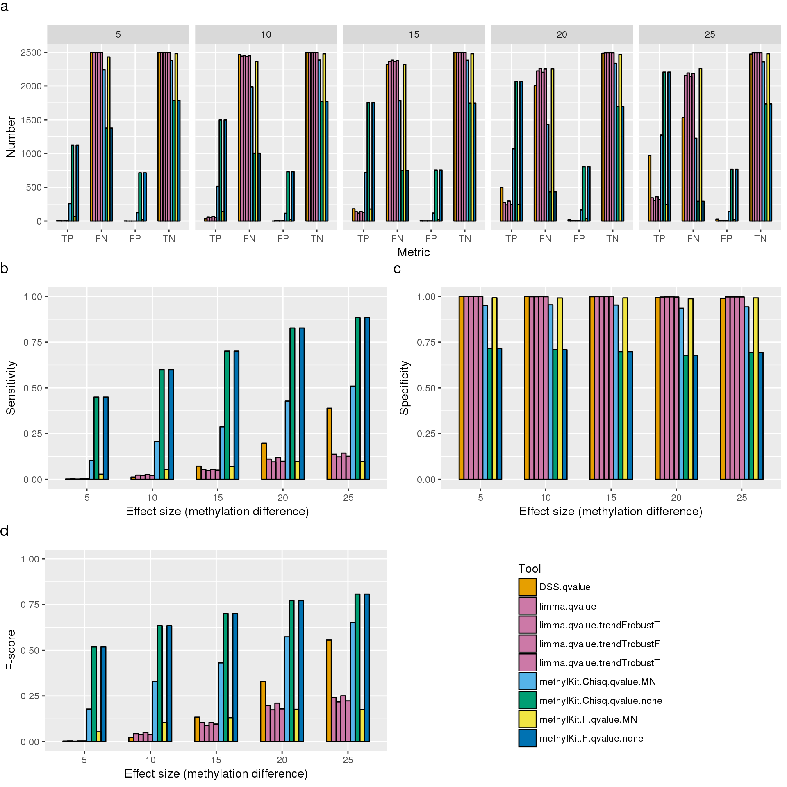
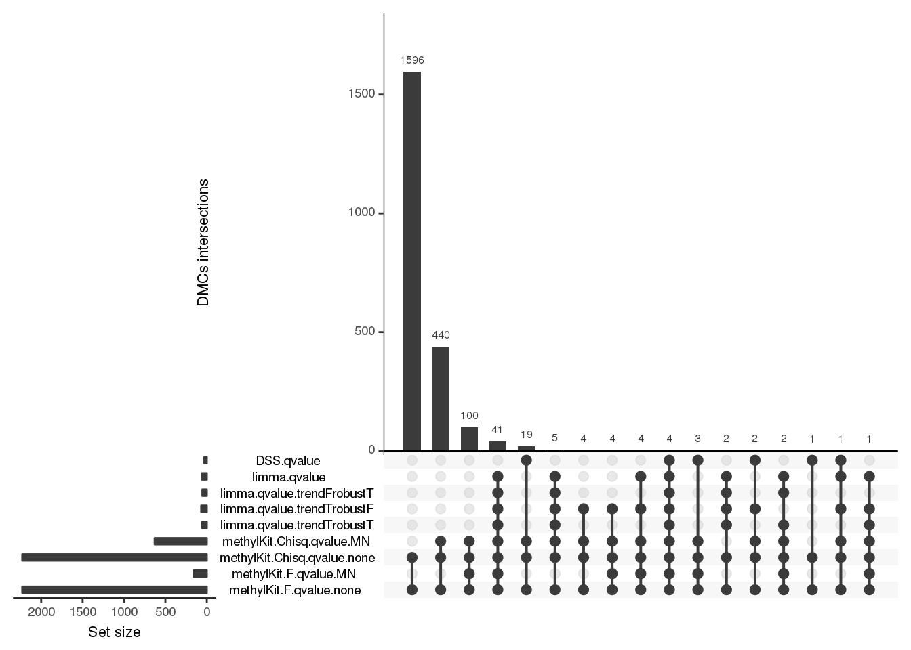
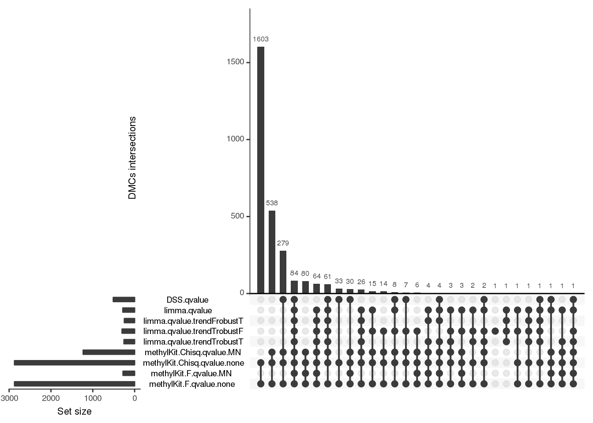

The comparison of differentially methylated bases detection tools on simulated data
================
Katarzyna Wreczycka
2017-08-04

Goal
====

Here, we examined the performance of various differential methylation methods. We compared three classes of methods:

1.  t-test/linear regression,
2.  logistic regression,
3.  beta binomial regression.

Three different tools were used:

1.  DSS (beta binomial regression),
2.  limma (linear regression),
3.  methylKit (logistic regression with/without overdispersion correction).

Functions
=========

Here are functions to run limma, DSS and methylKit and calculate sensitivity, specificity and F-score:

``` r
# Load libraries and functions
library("methylKit")
library(ggplot2)
library(reshape2)
library(gridExtra)
library(grid)
source("./functions/dataSim2.R")
source("./functions/limma.R")
```

``` r

#' Calculate rates of models compared to simulation
#' 
#' @param simOutput this is the output of dataSim2 function
#' @param sub.methylDiff this is the q-value filtered methylDiff object
#'                       output of getMethylDiff()
#' @return returns a vector of accuracy metrics, TP, FP, Sensivity, etc
calc.rates<-function(simOutput, sub.methylDiff){
  
  all=paste(simOutput[[1]][[1]],simOutput[[1]][[2]],
            simOutput[[1]][[3]])
  
  true.dm=all[simOutput[[2]]]
  true.ndm=all[-simOutput[[2]]]
  
  pred.dm=paste(sub.methylDiff[[1]],sub.methylDiff[[2]],
                sub.methylDiff[[3]])
  pred.ndm=all[! all %in% pred.dm]
  
  TP=sum(true.dm %in% pred.dm)
  
  FN=sum(pred.ndm %in% true.dm)
  
  FP=sum(pred.dm %in% true.ndm)
  
  TN=sum(pred.ndm %in% true.ndm)
  
  p = TP / (TP + FP)
  r = TP / (TP+FN)
  f_score = 2*((p*r)/(p+r))
  
  return(c(TP=TP,FN=FN,FP=FP,TN=TN,
           acc=(TP+TN)/length(all),
           spec=TN/(TN+FP) ,
           sens=TP/(TP+FN),
           f_score= f_score,
           precision=as.numeric(TP / (TP + FP)),
           recall=r,
           NPV= as.numeric(TN / (TN + FN))
           ) )
}


# ---------------------------------------------------------------------------- #
#' Run simulation
#' 
#' Call differentially methylated cytosines using methylKit, DSS and limma.
#' It calculate true positive positives (TP), false negatives (FN), false positives (FP),
#' accuracy (acc), specificity (spec), sensiticity (sens) and F-score (f_score).
#' 
#' @param sim.methylBase a methylBase object from the methylKit library
#' @param cores a number of cores
#' @param difference cutoff for absolute value of methylation percentage change
#'                   between test and control (default:5)
#' @param qvalue cutoff for qvalue of differential methylation statistic
#'               (default:0.01)
#' @return returns a matrix with TP, FN, FP, TN, acc, spec, sens, f_score (columns)
#'         using tools that calculate differentially methylated regions (rows)
run.models = function(sim.methylBase, cores=1,
                      difference=5, qvalue=0.01){
  
  require(methylKit)
  require(DSS)

  
  ## run methylkit
  combined = data.frame(test=c("F", "Chisq","F", "Chisq"),
                        adjust="qvalue",
                        overd=c("none","none", "MN", "MN"),
                        name=c("methylKit.F.qvalue.none",
                               "methylKit.Chisq.qvalue.none",
                               "methylKit.F.qvalue.MN",
                               "methylKit.Chisq.qvalue.MN"), 
                        stringsAsFactors = FALSE)
  diff.list = list()
  methylKit.list=list()
  for(i in 1:nrow(combined)){
    co = combined[i,]
    methylkit.obj <- calculateDiffMeth(sim.methylBase[[1]], 
                                       overdispersion=co$overd,
                                       adjust = co$adjust,
                                       test=co$test,
                                       mc.cores=cores)
    methylkit.obj.diff = getMethylDiff(methylkit.obj, 
                                       difference=difference,qvalue=qvalue)
    diff.list[[i]] <- methylkit.obj.diff
    methylKit.list[[i]]=calc.rates(sim.methylBase,
                                   methylkit.obj.diff)
    
  }
  names(methylKit.list) <- combined$name
  names(diff.list) <- combined$name
  
  
  ## run DSS
  dss.qvalue = calculateDiffMethDSS(sim.methylBase[[1]],
                                    adjust="qvalue",
                                    mc.cores=cores)
  dss.qvalue.diff = getMethylDiff(dss.qvalue, difference=difference,qvalue=qvalue)
  
  diff.list[["DSS.qvalue"]]=dss.qvalue.diff
  methylKit.list[["DSS.qvalue"]]=calc.rates(sim.methylBase, dss.qvalue.diff)

  ## run limma
  limma.qvalue=limma.meth(sim.methylBase[[1]])
  limma.qvalue.diff = getMethylDiff(limma.qvalue, 
                                    difference=difference,qvalue=qvalue)
  diff.list[["limma.qvalue"]] = limma.qvalue.diff
  methylKit.list[["limma.qvalue"]]=calc.rates(sim.methylBase,
                                              limma.qvalue.diff)
  
  limma.qvalue.tTrT=limma.meth(sim.methylBase[[1]], trend=TRUE, robust=TRUE)
  limma.qvalue.diff.tTrT = getMethylDiff(limma.qvalue.tTrT, 
                                    difference=difference,qvalue=qvalue)
  diff.list[["limma.qvalue.trendTrobustT"]] = limma.qvalue.diff.tTrT
  methylKit.list[["limma.qvalue.trendTrobustT"]]=calc.rates(sim.methylBase,
                                              limma.qvalue.diff.tTrT)

  limma.qvalue.tTrF=limma.meth(sim.methylBase[[1]], trend=TRUE, robust=FALSE)
  limma.qvalue.diff.tTrF = getMethylDiff(limma.qvalue.tTrF, 
                                    difference=difference,qvalue=qvalue)
  diff.list[["limma.qvalue.trendTrobustF"]] = limma.qvalue.diff.tTrF
  methylKit.list[["limma.qvalue.trendTrobustF"]]=calc.rates(sim.methylBase,
                                              limma.qvalue.diff.tTrF)
  
  limma.qvalue.tFrT=limma.meth(sim.methylBase[[1]], trend=FALSE, robust=TRUE)
  limma.qvalue.diff.tFrT = getMethylDiff(limma.qvalue.tFrT, 
                                    difference=difference,qvalue=qvalue)
  diff.list[["limma.qvalue.trendFrobustT"]] = limma.qvalue.diff.tFrT
  methylKit.list[["limma.qvalue.trendFrobustT"]]=calc.rates(sim.methylBase,
                                              limma.qvalue.diff.tFrT)
  
  list(
    diff.list=diff.list,
    rates=do.call("rbind",methylKit.list)
  )
}
```

Simulation
==========

We simulated a dataset consisting of 6 samples (3 controls and 3 samples with treatment). The read coverage modeled by a binomial distribution. The methylation background followed a beta distribution with parameters *a**l**p**h**a* = 0.4, *b**e**t**a* = 0.5 and *t**h**e**t**a* = 10. We simulated 6 sets of 5000 CpG sites where methylation at 50% of the sites was affected by the treatment to varying degrees - specifically, methylation was elevated by 5%, 10%, 15%, 20% and 25% in the test sample respectively in each set.

To adjust p-values for multiple testing, we used q-value method and we defined differentially methylated CpG sites with q-values below 0.01 for all examined methods. We calculated sensitivity, specificity and F-score for each of the three methods above. Sensitivity measured the proportion of true differentially methylated CpGs that were correctly identified as such, specificity was calculated as the proportion of detected CpGs that were truly not differentially methylated and correctly identified as such and F-score refers to a way to measure sensitivity and specificity by calculating their harmonic mean.

Here, we calculate sensitivity, specificity and F-score of performance of tools for calling differentially methylated cytosines:

``` r

# variables
effects = c(5, 10, 15, 20, 25)
cores=20

models.res=list()
set.seed(111)
for(effect in effects){
  
  # Effect by the treatment
  print(effect)

  # Generate simulated data using methylKit library
  sim.methylBase = dataSim2(replicates=6,
                                 sites=5000,
                                 treatment=c(1,1,1,0,0,0),
                                 percentage=50,
                                 effect=effect,
                                 add.info=TRUE)
  
  # Run models 
  models.res[[as.character(effect)]] = run.models(sim.methylBase, cores=cores,
                                                   difference=5, qvalue=0.01)
  
}
## [1] 5
## two groups detected:
##  will calculate methylation difference as the difference of
## treatment (group: 1) - control (group: 0)
## two groups detected:
##  will calculate methylation difference as the difference of
## treatment (group: 1) - control (group: 0)
## two groups detected:
##  will calculate methylation difference as the difference of
## treatment (group: 1) - control (group: 0)
## two groups detected:
##  will calculate methylation difference as the difference of
## treatment (group: 1) - control (group: 0)
## Using internal DSS code...
## Warning: 461 very small variances detected, have been offset away from zero

## Warning: 461 very small variances detected, have been offset away from zero
## [1] 10
## two groups detected:
##  will calculate methylation difference as the difference of
## treatment (group: 1) - control (group: 0)
## two groups detected:
##  will calculate methylation difference as the difference of
## treatment (group: 1) - control (group: 0)
## two groups detected:
##  will calculate methylation difference as the difference of
## treatment (group: 1) - control (group: 0)
## two groups detected:
##  will calculate methylation difference as the difference of
## treatment (group: 1) - control (group: 0)
## Using internal DSS code...
## Warning: 459 very small variances detected, have been offset away from zero
## Warning: 459 very small variances detected, have been offset away from zero
## [1] 15
## two groups detected:
##  will calculate methylation difference as the difference of
## treatment (group: 1) - control (group: 0)
## two groups detected:
##  will calculate methylation difference as the difference of
## treatment (group: 1) - control (group: 0)
## two groups detected:
##  will calculate methylation difference as the difference of
## treatment (group: 1) - control (group: 0)
## two groups detected:
##  will calculate methylation difference as the difference of
## treatment (group: 1) - control (group: 0)
## Using internal DSS code...
## Warning: 405 very small variances detected, have been offset away from zero
## Warning: 405 very small variances detected, have been offset away from zero
## [1] 20
## two groups detected:
##  will calculate methylation difference as the difference of
## treatment (group: 1) - control (group: 0)
## two groups detected:
##  will calculate methylation difference as the difference of
## treatment (group: 1) - control (group: 0)
## two groups detected:
##  will calculate methylation difference as the difference of
## treatment (group: 1) - control (group: 0)
## two groups detected:
##  will calculate methylation difference as the difference of
## treatment (group: 1) - control (group: 0)
## Using internal DSS code...
## Warning: 418 very small variances detected, have been offset away from zero
## Warning: 418 very small variances detected, have been offset away from zero
## [1] 25
## two groups detected:
##  will calculate methylation difference as the difference of
## treatment (group: 1) - control (group: 0)
## two groups detected:
##  will calculate methylation difference as the difference of
## treatment (group: 1) - control (group: 0)
## two groups detected:
##  will calculate methylation difference as the difference of
## treatment (group: 1) - control (group: 0)
## two groups detected:
##  will calculate methylation difference as the difference of
## treatment (group: 1) - control (group: 0)
## Using internal DSS code...
## Warning: 405 very small variances detected, have been offset away from zero
## Warning: 405 very small variances detected, have been offset away from zero


models.res.diff.orig = lapply(models.res, function(x) x$diff.list)
models.res.orig = lapply(models.res, function(x) x$rates)
names(models.res.orig) = effects
names(models.res.diff.orig) = effects
```

Visualisation
=============

Visualise sensitivity, specificity and F-score for different effect sizes.

Limma performs the worst in comparison to DSS and methylKit. Therefore, to ensure that it has the best performance possible, we compared its performance after using combination of different input arguments.

``` r

models.res=models.res.orig
models.res.diff=models.res.diff.orig

# Convert list of matrices to a data.frame
models.res.ma = do.call("rbind", models.res)
models.res.df = data.frame(models.res.ma)
models.res.df = cbind(models.res.df, 
                      tool=rownames(models.res.ma),
                      effect=as.factor(as.numeric(sapply(effects, 
                                               function(x) 
                                                 rep(x, nrow(models.res[[1]])  )))))

# Plot the True/false positives/negatives that were computed
msel = models.res.df[,c('TP','FN','FP','TN','tool', 'effect')]
mseldat <- melt(msel, id.vars=c("tool","effect"))
metrics = ggplot(mseldat, aes(variable, value, fill=tool)) + 
  geom_bar(stat="identity", position="dodge",colour="black",
           width=0.65)+
  scale_fill_manual(values=cbPalette)+
  labs(y="Number", x="Metric",fill='Tool')+
  facet_wrap(~effect, nrow=1)+
  theme(legend.position = "none")
```

``` r


# 1. Create the plots for sensitivity, specificity and F-score
#++++++++++++++++++++++++++++++++++

# A palette
cbPalette <- c( "#E69F00", "#CC79A7", "#CC79A7", "#CC79A7","#CC79A7","#56B4E9", "#009E73", "#F0E442", "#0072B2", "#D55E00", "#CC79A7")

p_sens<-ggplot(models.res.df,aes(effect, sens, fill=tool))+
  geom_bar(stat="identity",position='dodge',colour="black",
           width=0.65)+
  coord_cartesian(ylim=c(0.0,1.00))+
  scale_fill_manual(values=cbPalette)+
  labs(y="Sensitivity", x="Effect size (methylation difference)",fill='Tool')

p_spec<-ggplot(models.res.df,aes(effect, spec, fill=tool))+
  geom_bar(stat="identity",
           position="dodge",
           colour="black",
           width=0.65)+
  coord_cartesian(ylim=c(0.0,1.00))+
  scale_fill_manual(values=cbPalette)+
  labs(y="Specificity", x="Effect size (methylation difference)",fill='Tool')+
  theme(legend.position = "none")

p_recall <- ggplot(models.res.df,aes(effect, recall, fill=tool))+
  geom_bar(stat="identity",position='dodge',colour="black",
           width=0.65)+
  coord_cartesian(ylim=c(0.0,1.00))+
  scale_fill_manual(values=cbPalette)+
  labs(y="Recall", x="Effect size (methylation difference)",fill='Tool')+
  theme(legend.position = "none")

p_fscore <- ggplot(models.res.df,aes(effect, f_score, fill=tool))+
  geom_bar(stat="identity",position='dodge',colour="black",
           width=0.65)+
  coord_cartesian(ylim=c(0.0,1.00))+
  scale_fill_manual(values=cbPalette)+
  labs(y="F-score", x="Effect size (methylation difference)",fill='Tool')+
  theme(legend.position = "none")


# 2. Save the legend
#+++++++++++++++++++++++
get_legend<-function(myggplot){
  tmp <- ggplot_gtable(ggplot_build(myggplot))
  leg <- which(sapply(tmp$grobs, function(x) x$name) == "guide-box")
  legend <- tmp$grobs[[leg]]
  return(legend)
}
legend <- get_legend(p_sens)
# 3. Remove the legend from the box plot
#+++++++++++++++++++++++
p_sens <- p_sens+ theme(legend.position="none")


p_metrics1 <- arrangeGrob(metrics, top = textGrob("a", x=unit(0, "npc"),y=unit(1, "npc"),
                                               just=c("left","top"), gp=gpar(col="black", fontsize=14)))
  
p_sens1 <- arrangeGrob(p_sens, top = textGrob("b", x=unit(0, "npc"),y=unit(1, "npc"),
                                               just=c("left","top"), gp=gpar(col="black", fontsize=14)))
p_spec1 <- arrangeGrob(p_spec, top = textGrob("c", x=unit(0, "npc"),y=unit(1, "npc"),just=c("left","top"), gp=gpar(col="black", fontsize=14)))
p_fscore1 <- arrangeGrob(p_fscore, top = textGrob("d", x=unit(0, "npc"),y=unit(1, "npc"),just=c("left","top"), gp=gpar(col="black", fontsize=14)))

grid.arrange(p_metrics1,
             p_sens1, p_spec1,
             p_fscore1, legend,
             ncol = 2, nrow=3,
             layout_matrix = rbind(c(1,1),c(2,3), c(4,5)),
             widths=c(1,1))
```



Visualise intersections between DMCs from given tools for calling differentiall methylated cytosines for different effect sizes:

-   5
-   10
-   15
-   20
-   25

``` r

source("./functions/vis.R")

names_sets = rev(sort(as.character(levels(models.res.df$tool)))) # to plot tools in the same order as in barplots

plot.intersetion.tools(models.res.diff[['5']], vis=TRUE, keep.order=TRUE, sets = names_sets)
```


``` r

plot.intersetion.tools(models.res.diff[['10']], vis=TRUE, keep.order = TRUE, sets = names_sets)
```



``` r

plot.intersetion.tools(models.res.diff[['15']], vis=TRUE, keep.order = TRUE, sets = names_sets)
```


``` r

plot.intersetion.tools(models.res.diff[['20']], vis=TRUE, keep.order = TRUE, sets = names_sets)
```



``` r

plot.intersetion.tools(models.res.diff[['25']], vis=TRUE, keep.order=TRUE, sets = names_sets)
```


Results
=======

Visualise sensitivity, specificity and F-score for different effect sizes.

Limma performs very similar for all combinations of input argument trend=TRUE/FALSE and robust=TRUE/FALSE and we here chose trend=TRUE and robust=TRUE. methylKit with F-test was removed since it performs almost identical to methylKit with Chisq test.

``` r

models.res.diff=models.res.diff.orig
models.res=models.res.orig

wh.exlc = which(names( models.res.diff[[1]] ) %in% c("methylKit.F.qvalue.none","limma.qvalue","limma.qvalue.trendTrobustF","limma.qvalue.trendFrobustT"))
for( i in 1:length(models.res.diff)){
    models.res.diff[[i]] = models.res.diff[[i]][-wh.exlc]
    models.res[[i]] = models.res[[i]][-wh.exlc,]
}

# Rename names of tools
old.v=c("DSS.qvalue", "limma.qvalue.trendTrobustT","methylKit.F.qvalue.none", "methylKit.Chisq.qvalue.MN","methylKit.Chisq.qvalue.none", "methylKit.F.qvalue.MN", "methylKit.F.qvalue.none")
new.v=c("DSS",      "limma"   ,"methylKit-Ftest", "methylKit-Chisqtest-OC", "methylKit-Chisqtest", "methylKit-Ftest-OC", "methylKit-Ftest")
names(new.v) = old.v

for( i in 1:length(models.res.diff)){
    names( models.res.diff[[i]] ) = new.v[ match( names( models.res.diff[[i]] ), old.v ) ]
    rownames( models.res[[i]] ) = new.v[ match(  rownames( models.res[[i]] ), old.v ) ]
}

# Convert list of matrices to a data.frame
models.res.ma = do.call("rbind", models.res)
models.res.df = data.frame(models.res.ma)
models.res.df = cbind(models.res.df, 
                      tool=rownames(models.res.ma),
                      effect=as.factor(as.numeric(sapply(effects, 
                                               function(x) 
                                                 rep(x, nrow(models.res[[1]])  )))))
  

# Plot the True/false positives/negatives that were computed
cbPalette <- c( "#E69F00", "#56B4E9", "#009E73", "#F0E442", "#0072B2", "#D55E00", "#CC79A7")
msel = models.res.df[,c('TP','FN','FP','TN','tool', 'effect')]
mseldat <- melt(msel, id.vars=c("tool","effect"))
metrics = ggplot(mseldat, aes(variable, value, fill=tool)) + 
  geom_bar(stat="identity", position="dodge",colour="black",
           width=0.65)+
  scale_fill_manual(values=cbPalette)+
  labs(y="Number", x="Metric",fill='Tool')+
  facet_wrap(~effect, nrow=1)
#  theme(legend.position = "none")

#pdf("./figs_publication/simulated_metrics.pdf", width = 10, height = 3)
plot(metrics)
```


``` r
#dev.off()


# 1. Create the plots the plots for sensitivity, specificity and F-score
#++++++++++++++++++++++++++++++++++

# A palette
cbPalette <- c( "#E69F00", "#56B4E9", "#009E73", "#F0E442", "#0072B2", "#D55E00", "#CC79A7")

p_sens<-ggplot(models.res.df,aes(effect, sens, fill=tool))+
  geom_bar(stat="identity",position='dodge',colour="black",
           width=0.65)+
  coord_cartesian(ylim=c(0.0,1.00))+
  scale_fill_manual(values=cbPalette)+
  labs(y="Sensitivity", x="Effect size (methylation difference)",fill='Tool')
  

p_spec<-ggplot(models.res.df,aes(effect, spec, fill=tool))+
  geom_bar(stat="identity",
           position="dodge",
           colour="black",
           width=0.65)+
  coord_cartesian(ylim=c(0.0,1.00))+
  scale_fill_manual(values=cbPalette)+
  labs(y="Specificity", x="Effect size (methylation difference)",fill='Tool')+
  theme(legend.position = "none")

p_recall <- ggplot(models.res.df,aes(effect, recall, fill=tool))+
  geom_bar(stat="identity",position='dodge',colour="black",
           width=0.65)+
  coord_cartesian(ylim=c(0.0,1.00))+
  scale_fill_manual(values=cbPalette)+
  labs(y="Recall", x="Effect size (methylation difference)",fill='Tool')+
  theme(legend.position = "none")

p_fscore <- ggplot(models.res.df,aes(effect, f_score, fill=tool))+
  geom_bar(stat="identity",position='dodge',colour="black",
           width=0.65)+
  coord_cartesian(ylim=c(0.0,1.00))+
  scale_fill_manual(values=cbPalette)+
  labs(y="F-score", x="Effect size (methylation difference)",fill='Tool')+
  theme(legend.position = "none")


# 2. Save the legend
#+++++++++++++++++++++++
get_legend<-function(myggplot){
  tmp <- ggplot_gtable(ggplot_build(myggplot))
  leg <- which(sapply(tmp$grobs, function(x) x$name) == "guide-box")
  legend <- tmp$grobs[[leg]]
  return(legend)
}
legend <- get_legend(p_sens)
# 3. Remove the legend from the box plot
#+++++++++++++++++++++++
p_sens <- p_sens+ theme(legend.position="none")


p_sens1 <- arrangeGrob(p_sens, top = textGrob("a", x=unit(0, "npc"),y=unit(1, "npc"),
                                              just=c("left","top"), gp=gpar(col="black", fontsize=14)))
p_spec1 <- arrangeGrob(p_spec, top = textGrob("b", x=unit(0, "npc"),y=unit(1, "npc"),just=c("left","top"), gp=gpar(col="black", fontsize=14)))
p_fscore1 <- arrangeGrob(p_fscore, top = textGrob("c", x=unit(0, "npc"),y=unit(1, "npc"),just=c("left","top"), gp=gpar(col="black", fontsize=14)))


#pdf("./figs_publication/simulated_rates.pdf", width = 10, height = 7)
grid.arrange(p_sens1, p_spec1,
             p_fscore1, legend,
             ncol = 2, nrow=2)
```


``` r
#dev.off()
```

Visualise intersections between DMCs from given tools for calling differentiall methylated cytosines for different effect sizes:

-   5
-   10
-   15
-   20
-   25

``` r

source("./functions/vis.R")

#pdf("./figs_publication/plot.intersetion.tool.pdf", width = 10, height = 5)

names_sets = rev(sort(as.character(levels(models.res.df$tool)))) # to plot tools in the same order as in barplots

plot.intersetion.tools(models.res.diff[['5']], vis=TRUE, keep.order = TRUE, sets = names_sets, text.scale=c(2, 2, 2, 1.5, 2, 2.4))
```


``` r

plot.intersetion.tools(models.res.diff[['10']], vis=TRUE, keep.order = TRUE, sets = names_sets, text.scale=c(2, 2, 2, 1.5, 2, 2.4))
```


``` r

plot.intersetion.tools(models.res.diff[['15']], vis=TRUE, keep.order = TRUE, sets = names_sets, text.scale=c(2, 2, 2, 1.5, 2, 2.4))
```


``` r

plot.intersetion.tools(models.res.diff[['20']], vis=TRUE, keep.order = TRUE, sets = names_sets, text.scale=c(2, 2, 2, 1.5, 2, 2.4))
```


``` r

plot.intersetion.tools(models.res.diff[['25']], vis=TRUE, keep.order=TRUE, sets = names_sets, text.scale=c(2, 2, 2, 1.5, 2, 2.4))
```


``` r

#dev.off()
```

``` r
sessionInfo()
## R version 3.4.1 (2017-06-30)
## Platform: x86_64-pc-linux-gnu (64-bit)
## Running under: CentOS Linux 7 (Core)
## 
## Matrix products: default
## BLAS: /home/kwreczy/programs/R-3.4.1/lib64/R/lib/libRblas.so
## LAPACK: /home/kwreczy/programs/R-3.4.1/lib64/R/lib/libRlapack.so
## 
## locale:
##  [1] LC_CTYPE=en_US.UTF-8       LC_NUMERIC=C              
##  [3] LC_TIME=de_DE.UTF-8        LC_COLLATE=en_US.UTF-8    
##  [5] LC_MONETARY=de_DE.UTF-8    LC_MESSAGES=en_US.UTF-8   
##  [7] LC_PAPER=de_DE.UTF-8       LC_NAME=C                 
##  [9] LC_ADDRESS=C               LC_TELEPHONE=C            
## [11] LC_MEASUREMENT=de_DE.UTF-8 LC_IDENTIFICATION=C       
## 
## attached base packages:
##  [1] splines   grid      parallel  stats4    stats     graphics  grDevices
##  [8] utils     datasets  methods   base     
## 
## other attached packages:
##  [1] UpSetR_1.3.3               tidyr_0.6.3               
##  [3] dplyr_0.7.2                qvalue_2.8.0              
##  [5] limma_3.32.3               DSS_2.16.0                
##  [7] bsseq_1.12.2               SummarizedExperiment_1.6.3
##  [9] DelayedArray_0.2.7         matrixStats_0.52.2        
## [11] Biobase_2.36.2             emdbook_1.3.9             
## [13] gridExtra_2.2.1            reshape2_1.4.2            
## [15] ggplot2_2.2.1              methylKit_1.3.3           
## [17] GenomicRanges_1.28.4       GenomeInfoDb_1.12.2       
## [19] IRanges_2.10.2             S4Vectors_0.14.3          
## [21] BiocGenerics_0.22.0        rmarkdown_1.6             
## 
## loaded via a namespace (and not attached):
##  [1] mclust_5.3               Rcpp_0.12.12            
##  [3] locfit_1.5-9.1           lattice_0.20-35         
##  [5] Rsamtools_1.28.0         Biostrings_2.44.1       
##  [7] gtools_3.5.0             assertthat_0.2.0        
##  [9] rprojroot_1.2            digest_0.6.12           
## [11] R6_2.2.2                 plyr_1.8.4              
## [13] backports_1.1.0          evaluate_0.10.1         
## [15] coda_0.19-1              zlibbioc_1.22.0         
## [17] rlang_0.1.1              lazyeval_0.2.0          
## [19] data.table_1.10.4        R.utils_2.5.0           
## [21] R.oo_1.21.0              Matrix_1.2-10           
## [23] bbmle_1.0.19             labeling_0.3            
## [25] BiocParallel_1.10.1      statmod_1.4.30          
## [27] stringr_1.2.0            fastseg_1.22.0          
## [29] RCurl_1.95-4.8           munsell_0.4.3           
## [31] compiler_3.4.1           numDeriv_2016.8-1       
## [33] rtracklayer_1.36.4       pkgconfig_2.0.1         
## [35] htmltools_0.3.6          tibble_1.3.3            
## [37] GenomeInfoDbData_0.99.0  XML_3.98-1.9            
## [39] permute_0.9-4            GenomicAlignments_1.12.1
## [41] MASS_7.3-47              bitops_1.0-6            
## [43] R.methodsS3_1.7.1        gtable_0.2.0            
## [45] magrittr_1.5             scales_0.4.1            
## [47] stringi_1.1.5            XVector_0.16.0          
## [49] bindrcpp_0.2             tools_3.4.1             
## [51] glue_1.1.1               yaml_2.1.14             
## [53] colorspace_1.3-2         knitr_1.16              
## [55] bindr_0.1
```
