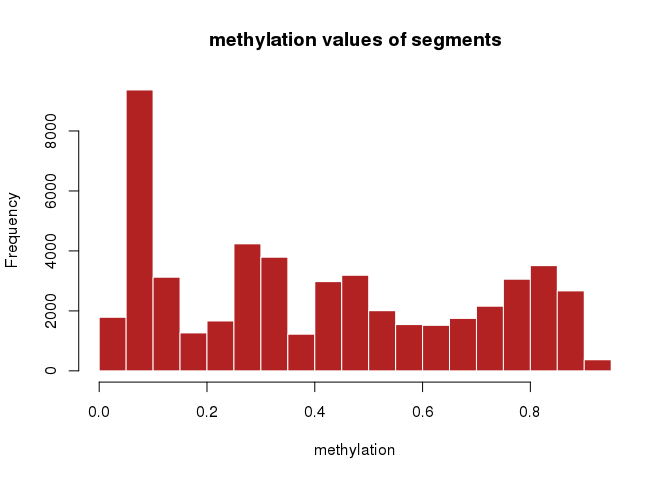
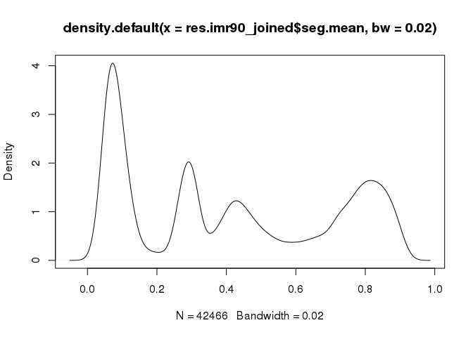
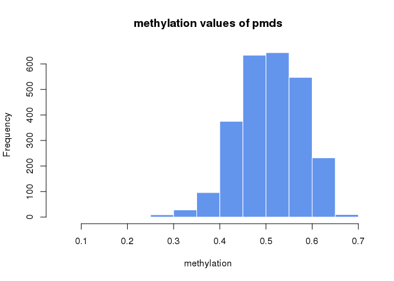
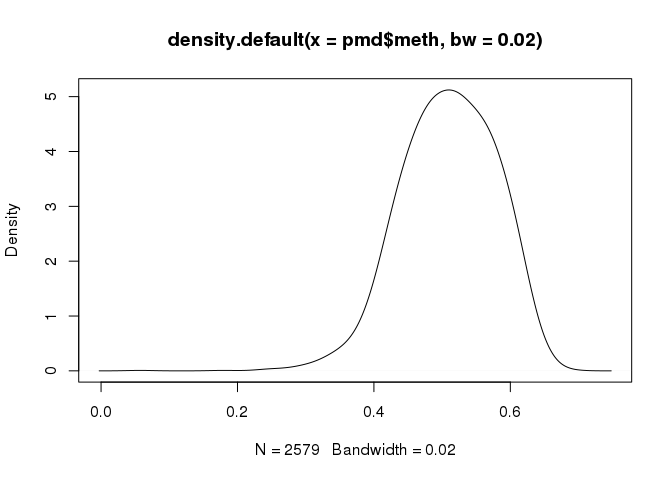

Strategies for analyzing bisulfite-seq data: Detection of MethPipe PMDs using methylKit on Human IMR90 methylome
================
Alexander Gosdschan
2017-08-09

Introduction
============

Partially methylated domains (PMDs) are another methylome feature found, for instance, in human fibroblast but not in H1 embryonic stem cells (Lister et al., Nature 2009). These large regions, spanning hundreds of kilobases, are characterized by highly disordered methylation with average levels of methylation below 70% and covering almost 40% of the genome. PMDs do not necessarily occur in every methylome, but their presence can be detected using a sliding window statistic (Burger et al., Nucleic Acids Res. 2013). In both MethylSeekR and MethPipe, the genome wide identification is done by training a two-state HMM, to separate PMDs from background regions.

Goal
====

We apply change-point based segmentation to a genome with PMDs. We segmented the Human IMR90 methylome from the Roadmap Epigenomics Project (Roadmap Epigenomics Consortium et al., Nature 2015) into four distinct features using methylKit. Then we compare feature-specific properties to published PMDs identified with MethPipe (Song et al., PLoS One. 2013).

Functions
=========

Load libraries and functions.

``` r
library(rtracklayer)
```

    ## Loading required package: methods

    ## Loading required package: GenomicRanges

    ## Loading required package: stats4

    ## Loading required package: BiocGenerics

    ## Loading required package: parallel

    ## 
    ## Attaching package: 'BiocGenerics'

    ## The following objects are masked from 'package:parallel':
    ## 
    ##     clusterApply, clusterApplyLB, clusterCall, clusterEvalQ,
    ##     clusterExport, clusterMap, parApply, parCapply, parLapply,
    ##     parLapplyLB, parRapply, parSapply, parSapplyLB

    ## The following objects are masked from 'package:stats':
    ## 
    ##     IQR, mad, sd, var, xtabs

    ## The following objects are masked from 'package:base':
    ## 
    ##     anyDuplicated, append, as.data.frame, cbind, colMeans,
    ##     colnames, colSums, do.call, duplicated, eval, evalq, Filter,
    ##     Find, get, grep, grepl, intersect, is.unsorted, lapply,
    ##     lengths, Map, mapply, match, mget, order, paste, pmax,
    ##     pmax.int, pmin, pmin.int, Position, rank, rbind, Reduce,
    ##     rowMeans, rownames, rowSums, sapply, setdiff, sort, table,
    ##     tapply, union, unique, unsplit, which, which.max, which.min

    ## Loading required package: S4Vectors

    ## 
    ## Attaching package: 'S4Vectors'

    ## The following object is masked from 'package:base':
    ## 
    ##     expand.grid

    ## Loading required package: IRanges

    ## Loading required package: GenomeInfoDb

``` r
library(methylKit)
library(reshape2)
library(genomation)
```

    ## Loading required package: grid

    ## 
    ## Attaching package: 'genomation'

    ## The following objects are masked from 'package:methylKit':
    ## 
    ##     getFeatsWithTargetsStats, getFlanks, getMembers,
    ##     getTargetAnnotationStats, plotTargetAnnotation

``` r
library(gridExtra)
```

    ## 
    ## Attaching package: 'gridExtra'

    ## The following object is masked from 'package:BiocGenerics':
    ## 
    ##     combine

``` r
library(ggplot2)
library(grid)
library(Gviz)

source("functions/functions.R")
```

Set global variables for input and output files.

``` r
data_dir <- "/data/akalin/agosdsc/projects/methylation_paper/data/IMR90/"
figure_dir <- "/data/akalin/agosdsc/projects/methylation_paper/figures/"
binary_dir <- "/home/agosdsc/projects/methylation_paper/bin/"

meth_bw <- "/data/akalin/Base/RoadmapEpigenomics/Experiment/DNAme_WGBS/FractionalMethylation_bigwig/E017_WGBS_FractionalMethylation.bigwig"
cov_bw <- "/data/akalin/Base/RoadmapEpigenomics/Experiment/DNAme_WGBS/ReadCoverage_bigwig/E017_WGBS_ReadCoverage.bigwig"

meth.preload_full <- paste0(data_dir,"IMR90_WGBS_Methylation.rds")


pmd_file <- paste0(data_dir,"Lister09_Human_hg19_IMR90.pmd.bb")
pmd_bed_file <- gsub(pattern = ".bb",replacement = ".bed",x = pmd_file)

kent.binary <- paste0(binary_dir,"bigBedToBed")
```

Load input data
===============

Download the WGBS data from Roadmap.

``` r
if(!dir.exists(data_dir) ) dir.create(data_dir,recursive = TRUE)
if(!dir.exists(figure_dir) ) dir.create(figure_dir,recursive = TRUE)
if(!dir.exists(binary_dir) ) dir.create(binary_dir,recursive = TRUE)

## WGBS methylation data Human IMR90

download.meth = function(output.file){
  url="http://egg2.wustl.edu/roadmap/data/byDataType/dnamethylation/WGBS/FractionalMethylation_bigwig/E017_WGBS_FractionalMethylation.bigwig"
  download.file(url, 
              destfile=output.file,
              method="wget",
              quiet = FALSE, mode = "w",
              cacheOK = TRUE)
}

#download.meth(meth_bw)

download.pmd = function(output.file){
  url="http://smithlab.usc.edu/methbase/data/Lister-ESC-2009/Human_IMR90/tracks_hg19/Human_IMR90.pmd.bb"
  download.file(url, 
              destfile=output.file,
              method="wget",
              quiet = FALSE, mode = "w",
              cacheOK = TRUE)
}

#download.pmd(pmd_file)

preload.meth <- function(meth.bw, chr=NULL,output.file) {

  meth <- BigWigFile(meth.bw)
  
  chrlens <- seqinfo(meth) # get all chrs
  
  if(is.null(chr)) { len <- seqlengths(chrlens) }
  else { len <- seqlengths(chrlens[chr]) } # length of chr 
  
  mbw <- import(meth, which=GRanges(seqnames=names(len),ranges=IRanges(1,len)))

  saveRDS(mbw,
          file = output.file)
  
}

#preload.meth(meth.bw = meth_bw,chr = NULL,output.file = meth.preload_full)
```

Preprocess Data
===============

Transform PMD track from BigBed to BED
--------------------------------------

The Pmd track is in BigBed format and we have to transform it into BED format. To achieve this we need to download the binary of the *bigBedToBed* tool from the binary utilities directory of UCSC [here](http://hgdownload.soe.ucsc.edu/admin/exe/) and put them in a bin folder inside the working directory. Then we can perform the transformation from BigBed to BED.

``` r
download.kent.binary <- function(output.file,os=c("linux","mac")) {
  
  if(os=="linux") url="http://hgdownload.soe.ucsc.edu/admin/exe/linux.x86_64/bigBedToBed"
  else if(os == "mac") url="http://hgdownload.soe.ucsc.edu/admin/exe/macOSX.x86_64/bigBedToBed"
  else stop("os not available")  
    
  download.file(url, 
              destfile=output.file,
              method="wget",
              quiet = FALSE, mode = "w",
              cacheOK = TRUE)
  
} 

#download.kent.binary(output.file = kent.binary, os = "linux")


cmd <- paste0("chmod +x ", kent.binary)
system(cmd)


cmd2 <- paste(kent.binary,pmd_file,pmd_bed_file)
system(cmd2)
```

### Aquire Methylation and Segment Information for PMDs

Since the PMD track does only contain the regions and no information about methylation score or number of CGs per segment, we need to get this information by overlapping those PMD regions with the methylation track.

``` r
## load both tracks
pmd <- import(pmd_bed_file)
mbw <- readRDS(meth.preload_full)

# library(GenomicRanges)
# 
## 
## modified from: https://stackoverflow.com/questions/21724616/average-signal-over-several-intervals-with-granges-in-r

#' Get and summarize signal over regions
#'
#' @param signal Granges containing the numeric signal of interest as score  
#' @param intervals GRanges containing the regions of interest 
#' @param FUN function to summarize the signal values over the interval (default: mean)
#'
#' @return aggregated list with numeric vector for signal and integer vector for overlapping intervals
#' @export
#'
getSignalOverInterval <- function(signal,intervals,FUN=mean) {
  overlaps <- findOverlaps(signal, intervals)
  signal <- signal[queryHits(overlaps)]
  averagedSignal <- aggregate(score(signal), list(subjectHits(overlaps)), FUN=FUN)
  # if(length(averagedSignal$x) == length(intervals)) return(averagedSignal$x)
  # else 
    return(averagedSignal)
}

pmd.meth <- getSignalOverInterval(signal = mbw,intervals = pmd,FUN = mean)
if(length(pmd) == length(pmd.meth$x)) { 
  pmd$meth <- pmd.meth$x
} else {
  pmd <- pmd[pmd.meth$Group.1]
  pmd$meth <- pmd.meth$x
}

pmd$num.marks <- countOverlaps(pmd,mbw)

saveRDS(pmd,paste0(data_dir,"Lister09_Human_hg19_IMR90_methylation.pmd.rds"))
```

Segment methylome using methylKit
---------------------------------

Now we can use methylKit to segment the full methylome one more time. After segmentation procedure we join directly neigbouring segments. We do this since segmentation and clustering are two distinct steps in methSeg(), leading to adjacent segments of the same class. This leads to a bias in average segment length which is removed by joining those neighbours. We are using the joined segments for remainder of the analysis.

``` r
# library(methylKit)
set.seed(123)

##load methylome
mbw <- readRDS(meth.preload_full)

## segment
res.imr90 = methSeg(mbw,diagnostic.plot=TRUE,minSeg=100,G=4)

saveRDS(res.imr90, file = paste0(data_dir,
                                 "methylKit_hg19_IMR90_methseg<minSeg=100,G=4>.rds"))

## join directly neigbouring segments:
## we do this since segmentation and clustering are two distinct steps in methSeg(),
## leading to adjacent segments of the same class. 
## This leads to a bias in average segment length which is removed by joining those neighbours. 
res.imr90_joined <- joinSegmentNeighbours(res = res.imr90)

saveRDS(res.imr90, file = paste0(data_dir,
                                 "methylKit_hg19_IMR90_methseg<minSeg=100,G=4>_joined.rds"))
```

Analyse data
============

We can shortly have a look at the general methylation distributions.

``` r
## load methylKit segments
res.imr90_joined <- readRDS(paste0(data_dir,"methylKit_hg19_IMR90_methseg<minSeg=100,G=4>_joined.rds"))

hist(res.imr90_joined$seg.mean,xlab="methylation",col="firebrick",
     main="methylation values of segments",border="white")
```



``` r
plot(density(res.imr90_joined$seg.mean,bw=0.02))
```



``` r
## load PMDs
pmd <- readRDS(paste0(data_dir,"Lister09_Human_hg19_IMR90_methylation.pmd.rds"))

hist(pmd$meth,xlab="methylation",col="cornflowerblue",
      main="methylation values of pmds",border="white")
```



``` r
plot(density(pmd$meth,bw=0.02))
```



And have a closer look on the distinct segment types. We overlap the PMDs with the four differnt methylKit segment classes.

``` r
## split up GRanges by segment type
res.imr90_joined.grl <- split(res.imr90_joined,f = res.imr90_joined$seg.group)

pmd.annot <- annotateWithFeatures(target = pmd,features = res.imr90_joined.grl,intersect.chr = TRUE)
```

    ## intersecting chromosomes...

    ## Warning in .Seqinfo.mergexy(x, y): Each of the 2 combined objects has sequence levels not in the other:
    ##   - in 'x': chr17_gl000205_random, chr19_gl000208_random, chr19_gl000209_random, chr1_gl000192_random, chr4_gl000193_random, chr4_gl000194_random, chr9_gl000199_random, chrUn_gl000211, chrUn_gl000212, chrUn_gl000213, chrUn_gl000214, chrUn_gl000216, chrUn_gl000217, chrUn_gl000218, chrUn_gl000219, chrUn_gl000220, chrUn_gl000221, chrUn_gl000222, chrUn_gl000224, chrUn_gl000225
    ##   - in 'y': chrM
    ##   Make sure to always combine/compare objects based on the same reference
    ##   genome (use suppressWarnings() to suppress this warning).

``` r
pmd.annot
```

    ## summary of target set annotation with feature annotation:

    ## Rows in target set: 2579

    ## ----------------------------

    ## percentage of target elements overlapping with features:

    ##     1     2     3     4 
    ## 53.08 37.61 93.64 35.05

    ## 

    ## percentage of feature elements overlapping with target:

    ##     1     2     3     4 
    ## 18.04 91.13 78.05  8.41

    ## 

We see that 93.6% of the PMDs overlap with the third segment class.

Create Figures
--------------

Now we create Figures 5a-c of the manuscript.

``` r
# Prepare Data for Plotting -----------------------------------------------

# Compare the Methylation distribution per segment
res.imr90_joined.seglength <- lapply(res.imr90_joined.grl,FUN = function(x) log10(width(x)))
res.imr90_joined.meth <- lapply(res.imr90_joined.grl,FUN = function(x) x$seg.mean)
res.imr90_joined.cg <- lapply(res.imr90_joined.grl,FUN = function(x) log10(x$num.mark) )

pmd.seglength <- list(pmd = log10(width(pmd)))
pmd.meth <- list(pmd = pmd$meth)
pmd.cg <- list(pmd = log10(pmd$num.marks))


# library(reshape2)

all.seglength <- rbind(data.frame(melt(res.imr90_joined.seglength), Tool = "methylKit"),
                       data.frame(melt(pmd.seglength),Tool = "MethPipe")
)

all.cg <- rbind(data.frame(melt(res.imr90_joined.cg), Tool = "methylKit"),
                data.frame(melt(pmd.cg),Tool = "MethylSeekR")
)

all.meth <- rbind(data.frame(melt(res.imr90_joined.meth), Tool = "methylKit"),
                  data.frame(melt(pmd.meth),Tool = "MethylSeekR")
)

feature.names <- c("Segment Class 1","Segment Class 2","Segment Class 3","Segment Class 4","PMD")

# Plotting ----------------------------------------------------------------

# taken from http://stackoverflow.com/questions/12539348/ggplot-separate-legend-and-plot and 
# http://www.sthda.com/english/wiki/ggplot2-easy-way-to-mix-multiple-graphs-on-the-same-page-r-software-and-data-visualization
# require(gridExtra)

get_legend<-function(myggplot){
  tmp <- ggplot_gtable(ggplot_build(myggplot))
  leg <- which(sapply(tmp$grobs, function(x) x$name) == "guide-box")
  legend <- tmp$grobs[[leg]]
  return(legend)
}

# 1. Create the plots
#++++++++++++++++++++++++++++++++++
# Create box plot
# require(ggplot2)
p_seglength <- ggplot(all.seglength, aes(y=value, x=L1,fill=Tool)) +
  geom_boxplot(outlier.size = 0.1)+
  coord_cartesian()+
  labs(y="Segment length distributions\nlog10(bp)", x="Feature")+
  scale_x_discrete(labels=feature.names)+
  theme(axis.text.x  = element_text(angle=45, vjust=1, hjust=1))
# p_seglength

p_cg <- ggplot(all.cg, aes(y=value, x=L1,fill=Tool)) +
  geom_boxplot(outlier.size = 0.1)+
  coord_cartesian()+
  labs(y="Number of CpGs per Segment\n log10 ", x="Feature")+
  scale_x_discrete(labels=feature.names)+          
  theme(axis.text.x  = element_text(angle=45, vjust=1, hjust=1),legend.position = "none")
#p_cg

p_meth <- ggplot(all.meth, aes(y=value, x=L1,fill=Tool)) +
  geom_boxplot(outlier.size = 0.1)+
  coord_cartesian()+
  labs(y="Methylation", x="Feature")+
  scale_x_discrete(labels=feature.names)+
  theme(axis.text.x  = element_text(angle=45, vjust=1, hjust=1),legend.position = "none")
# p_meth


# 2. Save the legend
# +++++++++++++++++++++++
legend <- get_legend(p_seglength)
# 3. Remove the legend from the box plot
#+++++++++++++++++++++++
p_seglength <- p_seglength + theme(legend.position="none")

# require(grid)
p_seglength <- arrangeGrob(p_seglength, top = textGrob("a", x=unit(0, "npc"),y=unit(1, "npc"),
                                                       just=c("left","top"), gp=gpar(col="black", fontsize=14)))

p_cg <- arrangeGrob(p_cg, top = textGrob("b", x=unit(0, "npc"),y=unit(1, "npc"),
                                         just=c("left","top"), gp=gpar(col="black", fontsize=14)))

p_meth <- arrangeGrob(p_meth, top = textGrob("c", x=unit(0, "npc"),y=unit(1, "npc"),
                                             just=c("left","top"), gp=gpar(col="black", fontsize=14)))


# 4. Arrange ggplot2 graphs with a specific width
#+++++++++++++++++++++++
pdf(file = paste0(figure_dir,"compPMDs.pdf") ,width = 10,height = 3.5)
grid.arrange(p_seglength, p_cg, p_meth,legend, 
             nrow=1,ncol=4,layout_matrix = rbind(c(1,2,3,4)),widths=c(1, 1,1,1))
dev.off()
```

    ## png 
    ##   2

This creates the Genome Browser View in Figure 5d of the manuscript.

``` r
# library(Gviz)

## this is the region of interest
## chr10:117,922,301-119,587,630
chr <- "chr10"
from <- 117922301
to <- 119587630

## create a Granges object for easy range selection
my_range1 <- GRanges(seqnames = chr,ranges = IRanges(start = from,end = to))

## create ideogram track
idxTrack <- IdeogramTrack(genome = "hg19", chromosome = chr)

## create genome axis track
axTrack <- GenomeAxisTrack()


## create reference gene track from RefSeq genes 
refGenes <- UcscTrack(genome = "hg19", chromosome = chr,table = "refGene",
                    track = "RefSeq Genes", from = from, to = to, 
                    trackType = "GeneRegionTrack", rstarts = "exonStarts", 
                    rends = "exonEnds", gene = "name2", symbol = "name", 
                    transcript = "name", strand = "strand", 
                    fill = "#8282d2", name = "RefSeq Genes")

## create CpGislands track
cpgIslands <- UcscTrack(genome = "hg19", chromosome = chr,
                        track = "cpgIslandExt", from = from, to = to,
                        trackType = "AnnotationTrack", start = "chromStart", 
                        end = "chromEnd", id = "name", shape = "box", 
                        fill = "#006400", name = "CpG Islands",stacking = "dense",
                        rot.title =0)


## load pmds
pmd <- readRDS(paste0(data_dir,"Lister09_Human_hg19_IMR90_methylation.pmd.rds"))

## create pmd track
pmdTrack <- AnnotationTrack(range = pmd, name = "PMD (Lister et al. 2009)",strand = "*",
                            chromosome = chr, from = from, to = to,
                            fill = "#00BFC4",rot.title =0,size=2
                            )


## load methylKit joined segments
res.imr90_joined <- readRDS(paste0(data_dir,"methylKit_hg19_IMR90_methseg<minSeg=100,G=4>_joined.rds"))

## create segments track
methSegTrack <- sapply(split(x = res.imr90_joined,f = res.imr90_joined$seg.group), 
                 function(x) {
                   AnnotationTrack(range = x,
                          name = paste("Segments Class", unique(x$seg.group)) ,
                          chromosome = chr, from = from, to = to,
                          fill = "#F8766D",rot.title =0,size=1.5
                          )
                   }
                 )


## load methylation data
mbw <- readRDS(meth.preload_full)

## create methylation track
methTrack <- DataTrack(range = mbw[mbw %over% my_range1], genome = "hg19",
                       type = "p", window = "auto", name = "Methylation\n(IMR90)", 
                       chromosome = chr, col = "black")


## save figure to pdf 
pdf(file = paste0(figure_dir, "PMD_track.pdf"),width = 10,height = 3.5)

plotTracks(c(list(idxTrack, 
                  axTrack, 
                  refGenes,
                  pmdTrack
                  ),
                  unlist(methSegTrack,use.names = FALSE),
                  list(methTrack,
                       cpgIslands)), 
             from = from, to = to, 
             cex.title= 0.7,title.width = 1.5,rot.title =0,
           cex = 0.7, 
           
              sizes = c(0.8,2.2,3,1.5,1.5,1.5,1.5,1.5,3,1.5),
           
           col="black", 
           fontcolor = "black",
           cex.axis= 0.6,col.line=NULL
)

dev.off()
```

    ## png 
    ##   2
