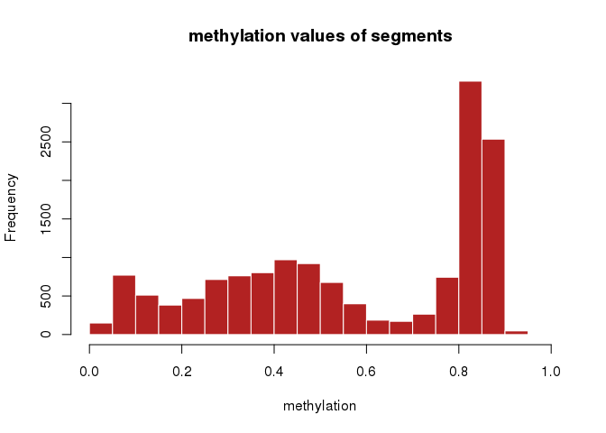
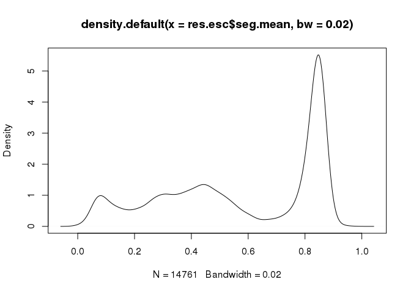
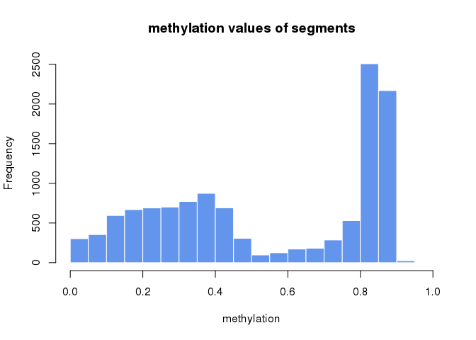
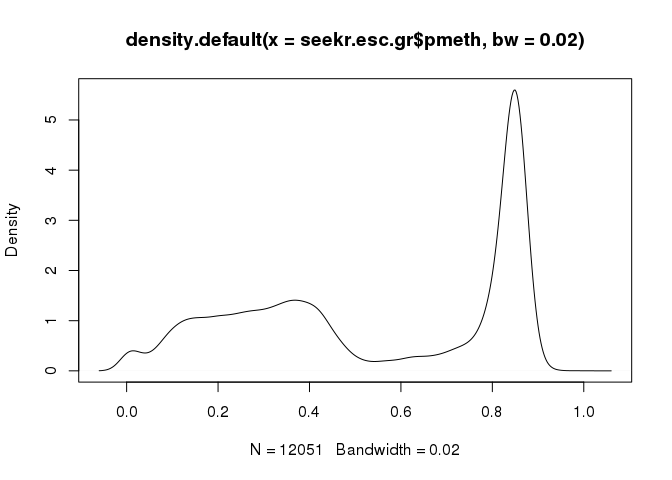

Strategies for analyzing bisulfite-seq data: Comparison MethylSeekR and methylKit on Human ESC methylome
================
Alexander Gosdschan
2017-08-08

Introduction
============

The analysis of methylation dynamics lead to many descriptions, e.g. a bimodal model of either hyper- or hypomethylated regions dependent on the local density of CpGs (Lövkvist et al., Nucleic Acids Res. 2016). However, given the detection of CpG-poor regions with locally reduced levels of methylation ( on average 30 % ) in pluripotent embryonic stem cells and in neuronal progenitors in both mouse and human, a different model seems also reasonable (Stadler et al., Nature 2011).

The identification of these low-methylated regions (LMRs) can be achieved by segmentation of the methylome using computational approaches. One of the well-known segmentation methods is based on a three-state Hidden Markov Model (HMM) taking only DNA methylation into account, without knowledge of any additional genomic information such as CpG density or functional annotations (Stadler et al., Nature 2011). Those three states are fully methylated regions (FMRs), unmethylated regions (UMRs) and low-methylated regions (LMRs). This segmentation represents a summary of methylome properties and features, in which unmethylated CpG islands correspond to UMRs (Deaton and Bird, Genes Dev. 2011), the majority is classified as FMR since most of the genome is methylated (Bird A, Genes Dev. 2002) and LMRs represent a new feature with intermediate levels of methylation, poor CpG content and shorter length compared to CpG islands (Stadler et al., Nature 2011).

Goal
====

We compared the results of change-point based segmentation implemented in methylKit to the method used in MethylSeekR based on HMMs but mainly using cutoffs for methylation values. We analysed chromosome 2 of the human H1 embryonic stem cell methylome from the Roadmap Epigenomics Project (Roadmap Epigenomics Consortium et al., Nature 2015).

Functions
=========

Load libraries and functions.

``` r
library(MethylSeekR)
```

    ## Loading required package: rtracklayer

    ## Loading required package: methods

    ## Loading required package: GenomicRanges

    ## Loading required package: stats4

    ## Loading required package: BiocGenerics

    ## Loading required package: parallel

    ## 
    ## Attaching package: 'BiocGenerics'

    ## The following objects are masked from 'package:parallel':
    ## 
    ##     clusterApply, clusterApplyLB, clusterCall, clusterEvalQ,
    ##     clusterExport, clusterMap, parApply, parCapply, parLapply,
    ##     parLapplyLB, parRapply, parSapply, parSapplyLB

    ## The following objects are masked from 'package:stats':
    ## 
    ##     IQR, mad, sd, var, xtabs

    ## The following objects are masked from 'package:base':
    ## 
    ##     anyDuplicated, append, as.data.frame, cbind, colMeans,
    ##     colnames, colSums, do.call, duplicated, eval, evalq, Filter,
    ##     Find, get, grep, grepl, intersect, is.unsorted, lapply,
    ##     lengths, Map, mapply, match, mget, order, paste, pmax,
    ##     pmax.int, pmin, pmin.int, Position, rank, rbind, Reduce,
    ##     rowMeans, rownames, rowSums, sapply, setdiff, sort, table,
    ##     tapply, union, unique, unsplit, which, which.max, which.min

    ## Loading required package: S4Vectors

    ## 
    ## Attaching package: 'S4Vectors'

    ## The following object is masked from 'package:base':
    ## 
    ##     expand.grid

    ## Loading required package: IRanges

    ## Loading required package: GenomeInfoDb

    ## Loading required package: mhsmm

    ## Loading required package: mvtnorm

``` r
library("BSgenome.Hsapiens.UCSC.hg19")
```

    ## Loading required package: BSgenome

    ## Loading required package: Biostrings

    ## Loading required package: XVector

    ## 
    ## Attaching package: 'Biostrings'

    ## The following object is masked from 'package:base':
    ## 
    ##     strsplit

``` r
library(rtracklayer)
require(genomation)
```

    ## Loading required package: genomation

    ## Loading required package: grid

``` r
library(methylKit)
```

    ## 
    ## Attaching package: 'methylKit'

    ## The following objects are masked from 'package:genomation':
    ## 
    ##     getFeatsWithTargetsStats, getFlanks, getMembers,
    ##     getTargetAnnotationStats, plotTargetAnnotation

``` r
require(reshape2)
```

    ## Loading required package: reshape2

``` r
require(gridExtra)
```

    ## Loading required package: gridExtra

    ## 
    ## Attaching package: 'gridExtra'

    ## The following object is masked from 'package:BiocGenerics':
    ## 
    ##     combine

``` r
require(ggplot2)
```

    ## Loading required package: ggplot2

``` r
require(grid)

source("functions/functions.R")
```

Set global variables for input and output files.

``` r
data_dir <- "/data/akalin/agosdsc/projects/methylation_paper/data/ESC/"
figure_dir <- "/data/akalin/agosdsc/projects/methylation_paper/figures/"


meth_bw <- "/data/akalin/Base/RoadmapEpigenomics/Experiment/DNAme_WGBS/FractionalMethylation_bigwig/E003_WGBS_FractionalMethylation.bigwig"
cov_bw <- "/data/akalin/Base/RoadmapEpigenomics/Experiment/DNAme_WGBS/ReadCoverage_bigwig/E003_WGBS_ReadCoverage.bigwig"

methtab_file <- paste0(data_dir,"Human_esc_hg19_chr2.tab")
meth.preload_chr2 <- paste0(data_dir,"ESC_WGBS_Methylation_chr2.rds")
meth.preload_full <- paste0(data_dir,"ESC_WGBS_Methylation.rds")
  
chromhmm_file <- paste0(data_dir,"E003_15_coreMarks_mnemonics.bed.gz")
chromhmm_states <- paste0(data_dir,"chromHMM.15states.txt")
```

Load input data
===============

Download the WGBS data from Roadmap.

``` r
if(!dir.exists(data_dir) ) dir.create(data_dir,recursive = TRUE)
if(!dir.exists(figure_dir) ) dir.create(figure_dir,recursive = TRUE)

## WGBS methylation data Human H1 ESC

download.meth = function(output.file){
  url="http://egg2.wustl.edu/roadmap/data/byDataType/dnamethylation/WGBS/FractionalMethylation_bigwig/E003_WGBS_FractionalMethylation.bigwig"
  download.file(url, 
              destfile=output.file,
              method="wget",
              quiet = FALSE, mode = "w",
              cacheOK = TRUE)
}

#download.meth(meth_bw)


## WGBS coverage data Human H1 ESC

download.cov = function(output.file){
  url="http://egg2.wustl.edu/roadmap/data/byDataType/dnamethylation/WGBS/ReadCoverage_bigwig/E003_WGBS_ReadCoverage.bigwig"
  download.file(url, 
              destfile=output.file,
              method="wget",
              quiet = FALSE, mode = "w",
              cacheOK = TRUE)
}

#download.cov(cov_bw)

## ChromHMM data Human H1 ESC

download.chromhmm = function(output.file){
  url="http://egg2.wustl.edu/roadmap/data/byFileType/chromhmmSegmentations/ChmmModels/core_K27ac/jointModel/final/all.mnemonics.bedFiles.tgz"
  download.file(url, 
              destfile=paste0(data_dir,"all.mnemonics.bedFiles.tgz"),
              method="wget",
              quiet = FALSE, mode = "w",
              cacheOK = TRUE)
  untar(paste0(data_dir,"all.mnemonics.bedFiles.tgz"),
        files = basename(output.file),exdir = dirname(output.file),
        compressed = "gzip")
  #unlink(paste0(data_dir,"all.mnemonics.bedFiles.tgz"))
  
}

#download.chromhmm(chromhmm_file)

write.chromhmm <- function(output.file) { 
  ## get the true state names from http://egg2.wustl.edu/roadmap/web_portal/chr_state_learning.html#core_15state and store into simple txt file
  
  chromHMM.15states <- 
  "STATE NO.    MNEMONIC    DESCRIPTION COLOR NAME  COLOR CODE
  1 TssA    Active TSS  Red 255,0,0
  2 TssAFlnk    Flanking Active TSS Orange Red  255,69,0
  3 TxFlnk  Transcr. at gene 5' and 3'  LimeGreen   50,205,50
  4 Tx  Strong transcription    Green   0,128,0
  5 TxWk    Weak transcription  DarkGreen   0,100,0
  6 EnhG    Genic enhancers GreenYellow 194,225,5
  7 Enh Enhancers   Yellow  255,255,0
  8 ZNF/Rpts    ZNF genes & repeats Medium Aquamarine   102,205,170
  9 Het Heterochromatin PaleTurquoise   138,145,208
  10    TssBiv  Bivalent/Poised TSS IndianRed   205,92,92
  11    BivFlnk Flanking Bivalent TSS/Enh   DarkSalmon  233,150,122
  12    EnhBiv  Bivalent Enhancer   DarkKhaki   189,183,107
  13    ReprPC  Repressed PolyComb  Silver  128,128,128
  14    ReprPCWk    Weak Repressed PolyComb Gainsboro   192,192,192
  15    Quies   Quiescent/Low   White   255,255,255"
  
  write(chromHMM.15states,output.file  )
}

#write.chromhmm(output.file = chromhmm_states)

preload.meth <- function(meth.bw, chr=NULL,output.file) {

  meth <- BigWigFile(meth.bw)
  
  chrlens <- seqinfo(meth) # get all chrs
  
  if(is.null(chr)) { len <- seqlengths(chrlens) }
  else { len <- seqlengths(chrlens[chr]) } # length of chr 
  
  mbw <- import(meth, which=GRanges(seqnames=names(len),ranges=IRanges(1,len)))

  saveRDS(mbw,
          file = output.file)
  
}

#preload.meth(meth.bw = meth_bw,chr = "chr2",output.file = meth.preload_chr2)
#preload.meth(meth.bw = meth_bw,chr = NULL,output.file = meth.preload_full)
```

Preprocess Data
===============

For MethylSeekR we need to create a custom table with those columns: `chromosome position Total-counts Methylation-counts`. We have a custom function to extract this information from methylation and coverage bigwig `readbw()`.

``` r
## we create the methylation table for the whole genome
tab <- readbw(methbw = meth_bw,covbw = cov_bw,chr = "chr2")

# for methylSeekR we need chromosome position Total counts Methylation counts
# select columns: chr start coverage numCs
methtab.dt <- tab[,c(1,2,5,6)]
# write output back into text file
write.table(methtab.dt, file = methtab_file,
            quote = FALSE, col.names = FALSE, row.names = FALSE, sep = "\t")
```

Segment using MethylSeekR
-------------------------

Use MethySeekR functions to get the required segmentation.

``` r
# Run MethylSeekR ---------------------------------------------------------
### here we use the steps described in the vignette to obtain our Segments


# library(MethylSeekR)
set.seed(123)


# biocLite("BSgenome.Hsapiens.UCSC.hg19")
# library("BSgenome.Hsapiens.UCSC.hg19")
sLengths=seqlengths(Hsapiens)
head(sLengths)

## load methylome
methFname <- methtab_file
meth.gr <- readMethylome(FileName=methFname, seqLengths=sLengths)

## detect the PMDs
PMDsegments.gr <- segmentPMDs(m=meth.gr, chr.sel="chr2",
                              seqLengths=sLengths, num.cores=4)

## save PMD ranges
savePMDSegments(PMDs=PMDsegments.gr,
                GRangesFilename=paste0(data_dir,"PMDs.gr.rds"), 
                TableFilename=paste0(data_dir,"PMDs.tab"))


## load CpGislands
# library(rtracklayer)
session <- browserSession()
genome(session) <- "hg19"
query <- ucscTableQuery(session, "cpgIslandExt")
CpGislands.gr <- track(query)
genome(CpGislands.gr) <- NA

CpGislands.gr <- suppressWarnings(resize(CpGislands.gr, 5000, fix="center"))


## calcute FDRs
stats <- calculateFDRs(m=meth.gr, CGIs=CpGislands.gr,PMDs = PMDsegments.gr,
                       num.cores=4)

FDR.cutoff <- 5 
m.sel <- 0.5 
n.sel=as.integer(names(stats$FDRs[as.character(m.sel), ]
                       [stats$FDRs[as.character(m.sel), ]<FDR.cutoff])[1])

## segment into UMRs and LMRs
UMRLMRsegments.gr <- segmentUMRsLMRs(m=meth.gr, meth.cutoff=m.sel,
                                     nCpG.cutoff=n.sel, PMDs = PMDsegments.gr,
                                     num.cores=10, myGenomeSeq=Hsapiens, 
                                     seqLengths=sLengths,pdfFilename = paste0(data_dir,"human_esc_hg19_chr2_segments.pdf"))

saveUMRLMRSegments(segs=UMRLMRsegments.gr,
                   GRangesFilename=paste0(data_dir,"UMRsLMRs.gr.rds"), 
                   TableFilename=paste0(data_dir,"UMRsLMRs.tab"))
```

### Find FMRs

Since MethylSeekR does not produce FMR ranges we need to create them ourselves.

``` r
## load methylseekR_hg19_chr2_umrlmr
seekr.esc <- readRDS(paste0(data_dir,"UMRsLMRs.gr.rds"))

seekr.esc
## no fmrs included so we take intermediate ranges as fmr
fmr <- gaps(seekr.esc)
fmr <- fmr[chrom(fmr)=="chr2"]
## remove stranded full chrom ranges
fmr <- fmr[-c(1,2)]

## we need addtional data as the mean methylation and #CG per segment 
mbw <- readRDS(file = meth.preload_chr2)
ovl <- findOverlaps(query = fmr, subject = mbw)
x_mean <- mclapply(unique(queryHits(ovl)), function(x) list(nCG = length(subjectHits(ovl[queryHits(ovl)==x])),pmeth=mean(mbw[subjectHits(ovl[queryHits(ovl)==x])]$score)),mc.cores = 10)
values(fmr) <- DataFrame(nCG = sapply(X = x_mean, function(x) x$nCG),pmeth=sapply(X = x_mean, function(x) x$pmeth),type="FMR")

## now we can "update" the orignal object 
seekr.esc.gr <- GRanges()
seekr.esc.gr <- c(seekr.esc.gr,fmr)
tmp <- seekr.esc
values(tmp)$nCG.segmentation <- NULL
values(tmp)$T <- NULL
values(tmp)$M <- NULL
values(tmp)$median.meth <- NULL
seekr.esc.gr <-  sort(c(seekr.esc.gr,tmp))
saveRDS(seekr.esc.gr,file = paste0(data_dir,"UMRsLMRsFMRs.gr.rds"))
```

Segment using methylKit
-----------------------

Now we can use methylKit to segment the full methylome one more time.

``` r
# library(methylKit)
set.seed(123)

mbw <- readRDS(meth.preload_full)

## we set the number of groups to be 3 
res = methSeg(mbw,diagnostic.plot=TRUE,maxInt=50,minSeg=5,G=3,eps=NULL)
saveRDS(res,file = paste0(data_dir,
                          "methylKit_hg19_methseg<maxInt=50,minSeg=5,G=3,eps=NULL>.rds"))
```

We can shortly have a look at the general methylation distributions.

``` r
## load methylKit segments
res.esc <- readRDS(paste0(data_dir,
                          "methylKit_hg19_methseg<maxInt=50,minSeg=5,G=3,eps=NULL>.rds"))

res.esc <- res.esc[chrom(res.esc)=="chr2"]

hist(res.esc$seg.mean,xlab="methylation",col="firebrick",
     main="methylation values of segments",border="white")
```



``` r
plot(density(res.esc$seg.mean,bw=0.02))
```



``` r
## load MethylSeekR segments
seekr.esc.gr <- readRDS(paste0(data_dir,"UMRsLMRsFMRs.gr.rds"))

hist(seekr.esc.gr$pmeth,xlab="methylation",col="cornflowerblue",
      main="methylation values of segments",border="white")
```



``` r
plot(density(seekr.esc.gr$pmeth,bw=0.02))
```



And have a closer look on the distinct segment types.

``` r
## split up GRanges by segment type
res.esc.grl <- split(res.esc,f = res.esc$seg.group)

seekr.esc.grl <- split(seekr.esc.gr,f = seekr.esc.gr$type)
# reorder to UMR < LMR < FMR
seekr.esc.grl <- seekr.esc.grl[c("UMR","LMR","FMR")]


# Compare the Methylation distribution per segment
res.esc.seglength <- lapply(res.esc.grl,FUN = function(x) log10(width(x)))
res.esc.meth <- lapply(res.esc.grl,FUN = function(x) x$seg.mean)
res.esc.cg <- lapply(res.esc.grl,FUN = function(x) log10(x$num.mark) )

seekr.esc.seglength <- lapply(seekr.esc.grl,FUN = function(x) log10(width(x)))
seekr.esc.meth <- lapply(seekr.esc.grl,FUN = function(x) x$pmeth)
seekr.esc.cg <- lapply(seekr.esc.grl,FUN = function(x) log10(x$nCG))


# require(reshape2)

feature.order <- c("1","UMR","2","LMR","3","FMR")
feature.names <- c("Segment Class 1","UMR","Segment Class 2","LMR","Segment Class 3","FMR")
feature.tool <- c("methylKit (3 Groups)","MethySeekR")
feature.colors <- c("#F8766D","#F8D56D")


all.seglength <- rbind(data.frame(melt(res.esc.seglength), Tool = "methylKit"),
                       data.frame(melt(seekr.esc.seglength),Tool = "MethylSeekR")
                       )
all.seglength$L1 <- factor(all.seglength$L1,levels = feature.order)

all.cg <- rbind(data.frame(melt(res.esc.cg), Tool = "methylKit"),
                  data.frame(melt(seekr.esc.cg),Tool = "MethylSeekR")
)
all.cg$L1 <- factor(all.cg$L1,levels = feature.order)

all.meth <- rbind(data.frame(melt(res.esc.meth), Tool = "methylKit"),
                       data.frame(melt(seekr.esc.meth),Tool = "MethylSeekR")
)
all.meth$L1 <- factor(all.meth$L1,levels = feature.order)
```

Now we overlap the segments with their functional annotation from Roadmap.

``` r
## Annotate wih chromHMM

# H1 chromHMM 15 states 
chromhmm.file <- chromhmm_file
chromhmm.states <- read.delim(chromhmm_states,stringsAsFactors = FALSE)

chromhmm <- genomation::readGeneric(chromhmm.file,meta.cols = list(state=4))
chromhmm.grl <- split(chromhmm,f = chromhmm$state)
chromhmm.grl <- chromhmm.grl[gtools::mixedorder(names(chromhmm.grl))]

## annotate methylKit res.esc
seg.annot.res.esc <- annotateWithFeatures(target = res.esc.grl,features = chromhmm.grl)
```

    ## Working on: 1

    ## Working on: 2

    ## Working on: 3

``` r
seg.annot.res.esc.mat <- heatTargetAnnotation(seg.annot.res.esc,
                                              plot = FALSE,
                                              precedence = TRUE)

colnames(seg.annot.res.esc.mat) <- chromhmm.states$DESCRIPTION

# # now annotate methylseekr ranges
seg.annot.seekr.esc <- annotateWithFeatures(target = seekr.esc.grl,features = chromhmm.grl)
```

    ## Working on: UMR

    ## Working on: LMR

    ## Working on: FMR

``` r
seg.annot.seekr.esc.mat <- heatTargetAnnotation(seg.annot.seekr.esc,
                                                plot = FALSE,
                                                precedence = TRUE)

colnames(seg.annot.seekr.esc.mat) <- chromhmm.states$DESCRIPTION


# require(reshape2)
mat <- rbind(seg.annot.res.esc.mat,seg.annot.seekr.esc.mat)
mat.m <- melt(mat,varnames = c("Feature","State"))
mat.m$Feature <- factor(mat.m$Feature,levels = c("1","UMR","2","LMR","3","FMR"))
```

And here we produce Figure 4 of the manuscript.

``` r
# taken from http://stackoverflow.com/questions/12539348/ggplot-separate-legend-and-plot and 
# http://www.sthda.com/english/wiki/ggplot2-easy-way-to-mix-multiple-graphs-on-the-same-page-r-software-and-data-visualization
require(gridExtra)

get_legend<-function(myggplot){
  tmp <- ggplot_gtable(ggplot_build(myggplot))
  leg <- which(sapply(tmp$grobs, function(x) x$name) == "guide-box")
  legend <- tmp$grobs[[leg]]
  return(legend)
}

# 1. Create the plots
#++++++++++++++++++++++++++++++++++
# Create box plot
require(ggplot2)
p_seglength <- ggplot(all.seglength, aes(y=value, x=L1,fill=Tool)) +
                  geom_boxplot(outlier.size = 0.1)+
                  coord_cartesian()+
                  labs(y="Segment length distributions\nlog10(bp)", x="Feature")+
                  scale_x_discrete(labels=feature.names)+
                  scale_fill_manual(values =feature.colors)+
                  theme(axis.text.x  = element_text(angle=45, vjust=1, hjust=1))
# p_seglength

p_cg <- ggplot(all.cg, aes(y=value, x=L1,fill=Tool)) +
            geom_boxplot(outlier.size = 0.1)+
            coord_cartesian()+
            labs(y="Number of CpGs per Segment\n log10 ", x="Feature")+
            scale_x_discrete(labels=feature.names)+          
            scale_fill_manual(values =feature.colors)+
            theme(axis.text.x  = element_text(angle=45, vjust=1, hjust=1),legend.position = "none")
#p_cg

p_meth <- ggplot(all.meth, aes(y=value, x=L1,fill=Tool)) +
          geom_boxplot(outlier.size = 0.1)+
          coord_cartesian()+
          labs(y="Methylation", x="Feature")+
          scale_x_discrete(labels=feature.names)+
          scale_fill_manual(values =feature.colors)+
          theme(axis.text.x  = element_text(angle=45, vjust=1, hjust=1),legend.position = "none")
# p_meth

p_heatmap <- ggplot(mat.m, aes(Feature, State)) + 
  geom_tile(aes(fill = value)) + 
  geom_text(aes(label = round(value, 1))) + 
  scale_fill_gradient(name="Percent\nOverlap",low = "white",high = "steelblue")+
  labs(y="Chromatin State", x="Feature")+
  scale_x_discrete(labels=feature.names)+
  theme(axis.text.x  = element_text(angle=45, vjust=1, hjust=1))
# p_heatmap


# 2. Save the legend
#+++++++++++++++++++++++
legend <- get_legend(p_seglength)
# 3. Remove the legend from the box plot
#+++++++++++++++++++++++
p_seglength <- p_seglength + theme(legend.position="none")

require(grid)
p_seglength <- arrangeGrob(p_seglength, top = textGrob("a", x=unit(0, "npc"),y=unit(1, "npc"),
                                                       just=c("left","top"), gp=gpar(col="black", fontsize=14)))

p_cg <- arrangeGrob(p_cg, top = textGrob("b", x=unit(0, "npc"),y=unit(1, "npc"),
                                                       just=c("left","top"), gp=gpar(col="black", fontsize=14)))

p_meth <- arrangeGrob(p_meth, top = textGrob("c", x=unit(0, "npc"),y=unit(1, "npc"),
                                                       just=c("left","top"), gp=gpar(col="black", fontsize=14)))

p_heatmap <- arrangeGrob(p_heatmap, top = textGrob("d", x=unit(0, "npc"),y=unit(1, "npc"),
                                                   just=c("left","top"), gp=gpar(col="black", fontsize=14)))


# 4. Arrange ggplot2 graphs with a specific width
#+++++++++++++++++++++++
pdf(file = paste0(figure_dir,"compTools.pdf"),width = 10,height = 7)
grid.arrange(p_seglength, p_cg, p_meth,legend,p_heatmap, nrow=2,ncol=4,layout_matrix = rbind(c(1,2,5,5),c(3,4,5,5)),widths=c(1, 1,1,1))
dev.off()
```

    ## png 
    ##   2

SessionInfo
===========

``` r
sessionInfo()
```

    ## R version 3.4.0 (2017-04-21)
    ## Platform: x86_64-redhat-linux-gnu (64-bit)
    ## Running under: CentOS Linux 7 (Core)
    ## 
    ## Matrix products: default
    ## BLAS/LAPACK: /usr/lib64/R/lib/libRblas.so
    ## 
    ## locale:
    ##  [1] LC_CTYPE=en_US.UTF-8       LC_NUMERIC=C              
    ##  [3] LC_TIME=en_US.UTF-8        LC_COLLATE=en_US.UTF-8    
    ##  [5] LC_MONETARY=en_US.UTF-8    LC_MESSAGES=en_US.UTF-8   
    ##  [7] LC_PAPER=en_US.UTF-8       LC_NAME=C                 
    ##  [9] LC_ADDRESS=C               LC_TELEPHONE=C            
    ## [11] LC_MEASUREMENT=en_US.UTF-8 LC_IDENTIFICATION=C       
    ## 
    ## attached base packages:
    ##  [1] grid      parallel  stats4    methods   stats     graphics  grDevices
    ##  [8] utils     datasets  base     
    ## 
    ## other attached packages:
    ##  [1] ggplot2_2.2.1                     gridExtra_2.2.1                  
    ##  [3] reshape2_1.4.2                    methylKit_1.2.0                  
    ##  [5] genomation_1.8.0                  BSgenome.Hsapiens.UCSC.hg19_1.4.0
    ##  [7] BSgenome_1.44.0                   Biostrings_2.44.2                
    ##  [9] XVector_0.16.0                    MethylSeekR_1.16.0               
    ## [11] mhsmm_0.4.16                      mvtnorm_1.0-6                    
    ## [13] rtracklayer_1.36.4                GenomicRanges_1.28.4             
    ## [15] GenomeInfoDb_1.12.2               IRanges_2.10.2                   
    ## [17] S4Vectors_0.14.3                  BiocGenerics_0.22.0              
    ## 
    ## loaded via a namespace (and not attached):
    ##  [1] Biobase_2.36.2             splines_3.4.0             
    ##  [3] R.utils_2.5.0              gtools_3.5.0              
    ##  [5] GenomeInfoDbData_0.99.0    Rsamtools_1.28.0          
    ##  [7] yaml_2.1.14                impute_1.50.1             
    ##  [9] numDeriv_2016.8-1          backports_1.1.0           
    ## [11] lattice_0.20-35            limma_3.32.3              
    ## [13] bbmle_1.0.19               digest_0.6.12             
    ## [15] qvalue_2.8.0               colorspace_1.3-2          
    ## [17] htmltools_0.3.6            Matrix_1.2-9              
    ## [19] R.oo_1.21.0                plyr_1.8.4                
    ## [21] XML_3.98-1.9               emdbook_1.3.9             
    ## [23] zlibbioc_1.22.0            scales_0.4.1              
    ## [25] BiocParallel_1.10.1        tibble_1.3.3              
    ## [27] seqPattern_1.8.0           SummarizedExperiment_1.6.3
    ## [29] lazyeval_0.2.0             mclust_5.3                
    ## [31] magrittr_1.5               evaluate_0.10.1           
    ## [33] R.methodsS3_1.7.1          MASS_7.3-47               
    ## [35] tools_3.4.0                data.table_1.10.4         
    ## [37] hms_0.3                    matrixStats_0.52.2        
    ## [39] gridBase_0.4-7             stringr_1.2.0             
    ## [41] munsell_0.4.3              plotrix_3.6-5             
    ## [43] DelayedArray_0.2.7         compiler_3.4.0            
    ## [45] fastseg_1.22.0             rlang_0.1.1               
    ## [47] RCurl_1.95-4.8             labeling_0.3              
    ## [49] bitops_1.0-6               rmarkdown_1.6             
    ## [51] gtable_0.2.0               R6_2.2.2                  
    ## [53] GenomicAlignments_1.12.1   knitr_1.16                
    ## [55] rprojroot_1.2              KernSmooth_2.23-15        
    ## [57] readr_1.1.1                stringi_1.1.5             
    ## [59] Rcpp_0.12.11               coda_0.19-1
